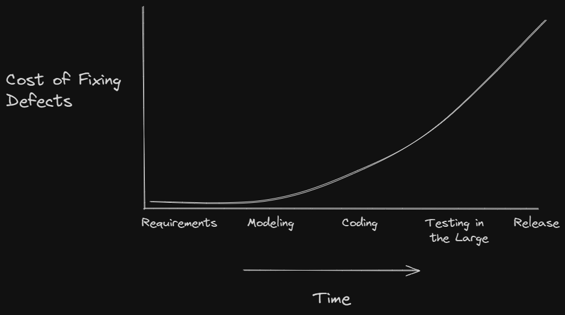
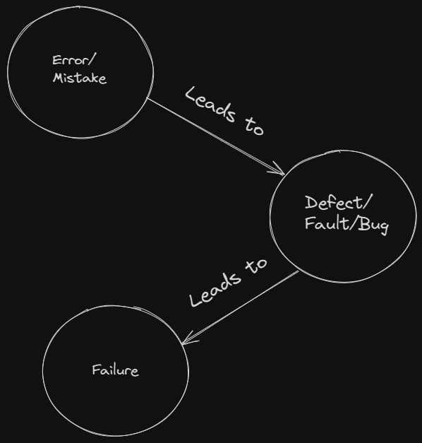

# Content Of Table

- [Fundamentals of Testing](#fundamentals-of-testing)
  - [What is Testing?](#what-is-testing)
  - [Test Objectives](#test-objectives)
  - [Principles of Testing](#principles-of-testing)
  - [Independence of Testing](#independence-of-testing)
  - [Errors, Defects, Failures, and Root Causes](#errors-defects-failures-and-root-causes)
  - [Testing and Debugging](#testing-and-debugging)
  - [Testing Process](#testing-process)
- [Summary](#summary)

# Fundamentals of Testing

## What is Testing?

Programinės įrangos testavimas - tai programinės įrangos funkcionalumo įvertinimo procesas, kurio metu siekiama rasti bet kokias programinės įrangos klaidas. Jo metu tikrinama, ar sukurta programinė įranga atitiko nustatytus reikalavimus, ir nustatomi visi programinės įrangos defektai, kad būtų sukurtas kokybiškas produktas.

## Test Objectives

**Explanation:**

Testavimo tikslai - tai tikslai ir rezultatai, kuriuos reikia pasiekti testuojant konkretų elementą ar sistemą. Jie išvedami iš produkto tikslų, reikalavimų ir testavimo strategijos. Testavimo tikslais vadovaujamasi vykdant testavimo procesą ir jie aiškiai apibrėžia testavimo pastangų kryptį. Jais taip pat remiamasi atliekant testavimo vertinimą ir testavimo užbaigimą.

**Key Concepts:**

1. **Darbo produktų vertinimas:** Tai apima įvairių darbo produktų, tokių kaip reikalavimai, naudotojų istorijos, projektai ir kodas, vertinimą, siekiant užtikrinti, kad jie atitiktų nustatytus kriterijus.

2. **Defektų nustatymas:** Vienas iš pagrindinių testavimo tikslų - rasti testuojamos sistemos defektus. Tai padeda pagerinti sistemos kokybę.

3. **Apimtis:** Testavimo tikslai dažnai apima tam tikro aprėpties lygio pasiekimą, kuris gali būti susijęs su reikalavimais, rizika, funkcionalumu, kodu ir kt.

4. **Rizikos mažinimas:** Testavimas padeda sumažinti nesėkmės gamybinėje aplinkoje riziką. Tai dažnai yra svarbus testavimo tikslas.

5. **Patikrinimas ir patvirtinimas:** Testavimo tikslai dažnai apima patikrinimą, ar sistema atitinka nurodytus reikalavimus (patikrinimas) ir ar ji atitinka numatytą paskirtį (patvirtinimas).

6. **Teisės aktų laikymasis:** Tam tikrose srityse teisės aktų reikalavimų laikymasis yra pagrindinis testavimo tikslas.

7. **Informacija sprendimams priimti:** Atliekant bandymus gaunama labai svarbi informacija apie sistemos kokybę, kuri padeda suinteresuotosioms šalims priimti pagrįstus sprendimus.

8. **Patikimumo didinimas:** Testavimas padeda įgyti pasitikėjimą, kad sistema veikia taip, kaip tikimasi, ir yra parengta išleidimui.

9. **Vartotojų pasitenkinimas:** Galiausiai testavimo tikslas - užtikrinti, kad sistema tenkintų vartotojo poreikius ir lūkesčius.

## Principles of Testing

Testavimo principai ir į taisykles orientuotas metodas yra tarsi dvi tos pačios monetos pusės programinės įrangos testavimo srityje.

Testavimo principai yra pagrindinės gairės, kuriomis vadovaujamasi testavimo procese. Jie apima tokias sąvokas, kaip ankstyvasis testavimas, pagal kurią testavimo procesas turi būti pradėtas kuo anksčiau programinės įrangos kūrimo ciklo metu, ir supratimas, kad išsamus testavimas yra neįmanomas, pagal kurį pripažįstama, kad dėl laiko ir išteklių trūkumo negalime išbandyti visų scenarijų.

Kita vertus, į taisykles orientuotas požiūris yra tarsi testavimo kelionės planas. Jame pateikiamos konkrečios taisyklės arba nurodymai, išplaukiantys iš programinės įrangos specifikacijų, projekto, įgyvendinimo ar srities žinių, kuriais vadovaujamasi, ką, kaip ir kada testuoti.

1. **Testavimas parodo defektų buvimą:** Testavimas gali parodyti, kad defektų yra, bet negali įrodyti, kad jų nėra. Testavimas sumažina tikimybę, kad programinėje įrangoje liks neatrastų defektų, tačiau, net jei defektų nerandama, tai nėra teisingumo įrodymas.

2. **Visapusiškas testavimas neįmanomas:** Neįmanoma išbandyti visų programinės įrangos įvesties, scenarijų ir kelių derinių. Vietoj to, siekiant sutelkti testavimo pastangas, naudojama rizikos analizė, prioritetai ir tokie metodai kaip ribinių verčių analizė ir lygiavertiškumo skaidymas.

3. **Vėlyvasis testavimas:** Norint anksti rasti defektų, testavimo veikla turėtų prasidėti kuo anksčiau programinės įrangos kūrimo ciklo metu ir turėtų būti orientuota į apibrėžtus tikslus.

4.**Defektų grupavimas:** Nedideliame skaičiuje modulių paprastai būna dauguma defektų, aptiktų prieš išleidimą atlikto testavimo metu, arba jie yra atsakingi už didžiąją dalį veiklos sutrikimų.Tai dar vadinama Pareto principu.

5.**Pesticido paradoksas:** Jei tie patys testai kartojami vis iš naujo, galiausiai jie nebeatras naujų klaidų.Kad tai būtų įveikta, reikia reguliariai peržiūrėti ir patikslinti testavimo atvejus ir parašyti naujus ir skirtingus testus skirtingoms programinės įrangos ar sistemos dalims patikrinti.

6.**Testavimas priklauso nuo konteksto:** skirtingais atvejais testavimas atliekamas skirtingai. Pavyzdžiui, saugai svarbi programinė įranga testuojama kitaip nei elektroninės prekybos svetainė.

7. **Klaida dėl klaidų nebuvimo:** Jei sistema neatitinka naudotojų poreikių ir lūkesčių, defektų radimas ir ištaisymas nebūtinai pagerina sistemą. Sistema, kurioje 100 % nėra klaidų, nebūtinai yra naudinga naudotojui.

## Independence of Testing

**Explanation:**

Testavimo nepriklausomumas - tai sąvoka, kai programinės įrangos produkto testavimą atlieka asmuo arba komanda, kuri yra atskira ir nepriklausoma nuo komandos, sukūrusios programinę įrangą. Taip siekiama užtikrinti nešališką požiūrį nustatant programinės įrangos defektus ir problemas.

Nepriklausomumo lygis gali būti įvairus. Jis gali būti įvairus - nuo kūrėjų, kurie patys atlieka testavimą, iki testavimo, kurį atlieka atskira tos pačios organizacijos komanda, ar net testavimo, kurį atlieka visiškai atskira organizacija.

**Key Concepts:**

1. **Objektyvumas:** Nepriklausomas testavimas suteikia objektyvų požiūrį į programinę įrangą, kuris padeda nustatyti defektus, kurių kūrimo komanda gali nepastebėti dėl to, kad yra susipažinusi su kodu.

2. **Šališkumo mažinimas:** Kadangi testavimo komanda yra atskirta nuo kūrimo komandos, sumažėja šališkumo rizika ir užtikrinamas išsamesnis ir nešališkesnis testavimo procesas.

3. **Ekspertizė:** Nepriklausomi testuotojai dažnai turi specializuotų įgūdžių ir žinių apie testavimo metodikas ir priemones, o tai gali prisidėti prie efektyvesnio testavimo proceso.

4. **Atskaitomybė:** Turint atskirą testavimo komandą, kūrimo komanda tampa atsakinga už savo darbo kokybę, nes bet kokius rastus defektus galima atsekti kūrimo procese.

5. **Kokybės užtikrinimas:** Nepriklausomas testavimas yra pagrindinė kokybės užtikrinimo sudedamoji dalis, nes jo metu patikrinama ir patvirtinama, ar programinės įrangos produktas atitinka nustatytus reikalavimus ir specifikacijas.

## Errors, Defects, Failures, and Root Causes

**Explanation:**

Šie terminai dažnai vartojami programinės įrangos testavimo kontekste, siekiant apibūdinti įvairius problemų, kurios gali kilti kuriant ir naudojant programinę įrangą, aspektus.

**Key Concepts:**

1. **Klaida:** Klaida, dar vadinama klaida, yra žmogaus veiksmas ar sprendimas, dėl kurio gaunamas neteisingas ar netikėtas rezultatas. Kuriant programinę įrangą tai gali būti programuotojo netyčia įvestas neteisingas kintamojo pavadinimas arba neteisingai suprastas reikalavimas.

2. **Defektas:** Defektas, dar vadinamas klaida, yra sistemos trūkumas arba nukrypimas nuo numatyto elgesio. Tai klaidos, kurią padarė programinę įrangą kuriantys žmonės, rezultatas. Pavyzdžiui, kodo dalis, kuri nedaro to, ką turėtų daryti, yra defektas.

3. **Gedimas:** Gedimas yra defekto pasireiškimas vykdant programinę įrangą. Tai, kai programinė įranga nedaro to, ko iš jos tikisi naudotojas. Pavyzdžiui, jei naudotojas paspaudžia mygtuką ir nieko neįvyksta, tai yra gedimas.

4. **Pagrindinė priežastis:** Pagrindinė priežastis - tai giliausiai slypinti defekto ar gedimo priežastis. Pagrindinės priežasties nustatymas padeda išvengti panašių defektų pasikartojimo ateityje. Pavyzdžiui, pagrindinė defekto priežastis gali būti reikalavimų nesupratimas arba klaida kode.

## Testing and Debugging

**Explanation:**

Testavimas ir gedimų šalinimas yra du svarbūs programinės įrangos kūrimo proceso etapai, kurie kartu užtikrina programinės įrangos produkto kokybę.

1. **Testavimas:** Tai programos ar sistemos vykdymo procesas, kurio metu siekiama rasti klaidų. Testavimo tikslas - užtikrinti, kad programinė įranga elgtųsi taip, kaip tikimasi, ir atitiktų jai keliamus reikalavimus. Jis apima įvairių tipų testus, pavyzdžiui, vienetų testus, integracijos testus, sistemos testus ir priėmimo testus.

2. **Trūkumų šalinimas:** Testavimo metu nustačius klaidą, trūkumų šalinimas - tai procesas, kurio metu nustatoma tiksli tos klaidos vieta ir priežastis kode. Trukdžių šalinimas apima žingsnius per kodą, kintamųjų tikrinimą ir programos srauto supratimą, kad būtų galima ištaisyti klaidą.

Testavimo tikslas - rasti klaidas, o debuginimas - suprasti ir ištaisyti šias klaidas.

**Key Concepts:**

1. **Klaidų aptikimas:** Testavimas naudojamas programinėje įrangoje esančioms klaidoms aptikti. Juo tikrinama, ar programinė įranga įvairiomis sąlygomis elgiasi taip, kaip tikimasi.

2. **Klaidų diagnozavimas ir taisymas:** Debuginimas naudojamas testavimo metu aptiktoms klaidoms diagnozuoti ir taisyti. Jis apima klaidos atsekimą iki jos šaltinio kode ir jos ištaisymą.

3. **Programinės įrangos kokybė:** Tiek testavimas, tiek debuginimas yra būtini programinės įrangos kokybei užtikrinti. Testavimu užtikrinama, kad programinė įranga atitiktų jai keliamus reikalavimus, o derinimu - kad rastos klaidos būtų tinkamai ištaisytos.

4. **Iteracinis procesas:** Testavimas ir debuginimas yra iteraciniai procesai. Pridėjus naujų funkcijų arba pakeitus esamas, programinę įrangą reikia dar kartą išbandyti ir galbūt derinti, kad būtų užtikrinta, jog ji ir toliau veiks teisingai.

## Testing Process

**Explanation:**

Testavimo procesui įtakos turi daugybė veiksnių, įskaitant suinteresuotųjų šalių poreikius ir lūkesčius, komandos narių įgūdžius ir galimybes, testuojamo objekto svarbą, naudojamos programinės įrangos ir technologijos tipą, projekto apribojimus, organizacinius veiksnius, programinės įrangos kūrimo gyvavimo ciklą, įrankių prieinamumą ir tinkamumą naudoti. Šie veiksniai gali turėti įtakos daugeliui su bandymais susijusių klausimų, įskaitant testavimo strategiją, naudojamus tetsavimo metodus, testavimo automatizavimo laipsnį, reikiamą aprėpties lygį, testavimo dokumentacijos išsamumą ir ataskaitų rengimą.

**Key Concepts:**

1. **Testavimo planavimas:** Tai apima testavimo tikslų apibrėžimą ir metodo, kuris geriausiai padėtų pasiekti šiuos tikslus, pasirinkimą atsižvelgiant į bendrą kontekstą. Tai apima testavimo apimties nustatymą, reikiamų išteklių įvertinimą ir testavimo veiklos planavimą.

2. **Testavimo stebėjimas ir kontrolė:** Tai apima nuolatinį visų testavimo veiksmų tikrinimą ir faktinės pažangos palyginimą su planu. Ji taip pat apima būtinų veiksmų, kad būtų pasiekti testavimo tikslai, ėmimąsi.

3. **Testavimo analizė:** Tai apima testavimo pagrindo analizę, siekiant nustatyti testuotinas funkcijas ir apibrėžti bei nustatyti prioritetines susijusias testavimo sąlygas.Ji taip pat apima testavimo pagrindo ir testavimo objektų įvertinimą, siekiant nustatyti visus galimus jų defektus ir įvertinti jų testavimo galimybes.

4. **Testų dizainas:** Tai reiškia, kad testavimo sąlygos turi būti parengtos pagal testavimo atvejus ir kitą testavimo programinę įrangą. Jis taip pat apima aprėpties objektų nustatymą, bandymų duomenų reikalavimų apibrėžimą, bandymų aplinkos projektavimą ir bet kokios kitos reikalingos infrastruktūros ir priemonių nustatymą.

5. **Testų įgyvendinimas:** Tai apima testų vykdymui reikalingos testų programinės įrangos sukūrimą arba įsigijimą. Jis apima testavimo atvejų organizavimą į testavimo procedūras, rankinių ir automatizuotų testavimo scenarijų kūrimą, testavimo procedūrų prioritetų nustatymą ir testavimo aplinkos sukūrimą.

6. **Testų vykdymas:** Tai apima testų vykdymą pagal testų vykdymo tvarkaraštį. Ji apima faktinių testų rezultatų palyginimą su laukiamais rezultatais, testų rezultatų registravimą ir anomalijų analizę, siekiant nustatyti tikėtinas jų priežastis.

7. **Testavimo užbaigimas:** Tai apima testavimo veiklos užbaigimą projekto etapuose. Ji apima bet kokios testavimo įrangos, kuri gali būti naudinga ateityje, nustatymą ir archyvavimą, testavimo aplinkos išjungimą, testavimo veiklos analizę siekiant nustatyti įgytą patirtį ir testavimo užbaigimo ataskaitos parengimą.

# Summary

1. **Testavimas:** Tai programinės įrangos įvertinimo procesas, kurio metu siekiama rasti bet kokias programinės įrangos klaidas ir užtikrinti, kad ji atitiktų nustatytus reikalavimus.

2. **Testavimo tikslai:** Tai tikslai ir rezultatai, kuriuos reikia pasiekti testuojant programinės įrangos sistemą. Jais vadovaujamasi atliekant testavimo procesą ir jie suteikia aiškų testavimo pastangų kryptingumą.

3. **Testavimo principai:** Tai pagrindinės gairės, kuriomis vadovaujamasi testavimo procese. Jie apima tokias sąvokas kaip ankstyvasis testavimas, supratimas, kad išsamus testavimas neįmanomas, ir pesticidų paradoksas.

4. **Testavimo nepriklausomumas:** Tai reiškia programinės įrangos produkto testavimą, kurį atlieka asmuo arba komanda, atskira ir nepriklausoma nuo komandos, kuri sukūrė programinę įrangą. Tai užtikrina nešališką požiūrį nustatant defektus.

5. **Klaidos, defektai, nesėkmės ir pagrindinės priežastys:** Šiais terminais apibūdinami įvairūs problemų, kurios gali kilti kuriant ir naudojant programinę įrangą, aspektai. Klaidos - tai žmogaus klaidos, defektai - sistemos trūkumai, gedimai - defektų apraiškos, o pagrindinės priežastys - giliausios pagrindinės defekto ar gedimo priežastys.

6. **Testavimas ir debuginimas:** Testavimas - tai programos vykdymo procesas, kurio metu ieškoma klaidų, o debuginimas- tai procesas, kurio metu nustatoma tiksli tos klaidos vieta ir priežastis kode. Testavimo tikslas - surasti klaidas, o debuginimas - suprasti ir ištaisyti šias klaidas.

7. **Testavimo procesas:** jam įtakos turi įvairūs aplinkos veiksniai ir jis apima keletą etapų, įskaitant testavimo planavimą, testavimo stebėseną ir kontrolę, testavimo analizę, testavimo projektavimą, testavimo įgyvendinimą, testavimo vykdymą ir testavimo užbaigimą.