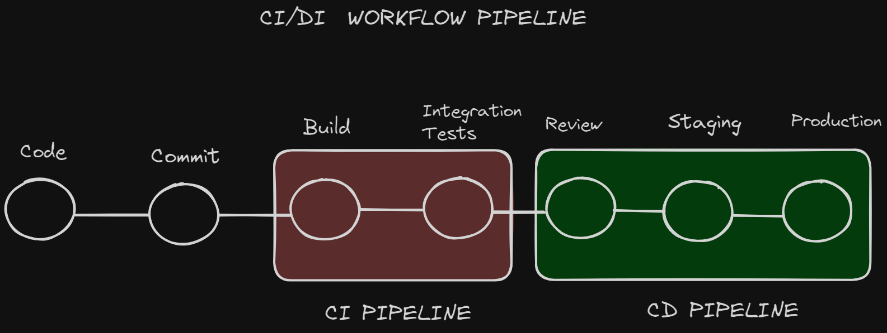

# CI/CD

**Explanation:**

CI/CD introduces ongoing automation and continuous monitoring throughout the lifecycle of apps, from integration and testing phases to delivery and deployment. This process, also known as a CI/CD pipeline, is an part of DevOps practices.

1. **Code:** Developers write and commit code in a version control system like Git.

2. **Commit:** Changes are committed and pushed to the repository.

3. **CI Pipeline:** This is triggered by the commit to the repository.

    - **Build:** The code is compiled, if necessary, and dependencies are fetched. The application is packaged for deployment.

    - **Integration Tests:** These tests check that different parts of the system work together as expected.

4. **CD Pipeline:**

    - **Review:** The changes are reviewed and approved for deployment. This review process can involve various static techniques.

    - **Staging:** The application is deployed to a staging environment that closely mirrors production.

    - **Production:** If everything in the staging environment works as expected, the application is deployed to the production environment.

**Key Concepts:**

1. **Continuous Integration (CI):**  Integration can then be verified by an automated build and automated tests. The main goal of CI is to prevent integration problems, which can happen when developers work separately on different features then try to merge their changes all at once.

    - **Integration Testing:** This is a crucial part of the CI process. During this phase, different pieces of the system are tested together to ensure they interact correctly.

        - **Unit Tests:** These are the lowest level of tests and are typically run first. They test individual components or functions in isolation.

        - **API Testing:** These tests ensure that the API endpoints are working as expected.

        - **System Testing:** These tests check the system as a whole to ensure it meets the specified requirements. System testing is typically done after unit and API testing, as it requires the individual components and APIs to be working correctly.

        - **End-to-End (e2e) Testing:** These tests involve testing the entire application from start to finish, ensuring that the flow of actions from the user's perspective works as expected. E2E testing is typically done after system testing, as it requires the entire system to be functioning correctly.

2. **Continuous Deployment (CD):** is a software release process that uses automated testing to validate if changes to a codebase are correct and stable for immediate autonomous deployment to a production environment. This approach ensures that you have a clean, deployable code base at any point in time, which can be beneficial for quickly addressing bugs or adding new features.

    - **Review:** The changes are reviewed and approved for deployment. This review process can involve various static techniques, including linting, to ensure the quality of the code. If the review identifies any issues, those issues must be fixed before the changes can be approved for deployment.

        - **Linting:** This involves running a linter on the code to automatically check for programming errors, bugs, stylistic errors, and suspicious constructs. If the linter flags any issues, those issues must be fixed before the changes can be approved for deployment.
