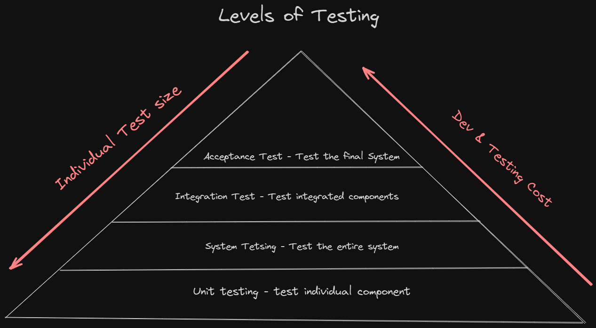

# Content of Table

- [Levels of Testing](#levels-of-testing)
  - [Component Testing (Unit Testing)](#component-testing-unit-testing)
  - [Component Integration Testing (Unit Integration Testing)](#component-integration-testing-unit-integration-testing)
  - [System Testing](#system-testing)
  - [System Integration Testing](#system-integration-testing)
  - [Acceptance Testing](#acceptance-testing)

## Levels of Testing

### Component Testing (Unit Testing)

**Explanation:**

Component Testing, also known as Unit Testing, is the first level of software testing where individual components (or units) of a software are tested. The purpose is to validate that each unit of the software performs as designed.

**Key Concepts:**

1. **Isolation:** In unit testing, components are tested in isolation from the rest of the system. This means that if a test fails, it's clear that the fault is within the unit under test.

2. **Mocking/Stubs:** To achieve isolation, other components that the unit interacts with may need to be simulated, often using techniques like mocking or stubbing.

3. **White-Box Testing:** Unit testing is a type of white-box testing as it requires knowledge of the internal workings of the unit to write the tests.

4. **Automated:** Unit tests are typically automated and run as part of the build process. This allows for regular regression testing as the codebase evolves.

5. **Test-Driven Development (TDD):** Unit testing is a key part of TDD, a development methodology where failing unit tests are written before the code is written to make them pass.

6. **Coverage:** A measure of how much of the codebase is tested by unit tests. High coverage is desirable as it reduces the chance of an undetected bug.

7. **Functional Testing:** Functional testing can also be part of unit testing. It ensures that each function of the software operates in conformance with the requirement specification at the unit level.

### Component Integration Testing (Unit Integration Testing)

**Explanation:**

Component Integration Testing, also known as Unit Integration Testing, is the process of combining two or more units (components) and testing them as a group.

**Key Concepts:**

1. **Interaction Between Units:** The main focus of integration testing is to test the interaction points between different units. It checks how well they work together and whether there are any issues when data is exchanged between them.

### System Testing

**Explanation:**

System Testing is a level of testing that validates the complete and integrated software product. The purpose of system testing is to evaluate the system's compliance with the specified requirements.

**Key Concepts:**

1. **Whole System:** System testing involves testing the entire system as a whole. It's conducted on a complete, integrated system to evaluate the system's compliance with its specified requirements.

2. **Black Box Testing:** System testing is a type of black-box testing, where the focus is on the input and output of the system. The internal structure of the application is not considered during system testing.

3. **Functional and Non-Functional Testing:** System testing covers both functional and non-functional testing. Functional testing checks if the system behaves as expected, while non-functional testing checks aspects like performance, usability, reliability.

4. **Test Environment:** System testing should be conducted in an environment that closely mirrors the production environment.

### System Integration Testing

**Explanation:**

System Integration Testing (SIT) is a testing phase where individual units or components of a software system are combined and tested as a group. The main purpose of SIT is to ensure that different components of the system work together as expected.

**Key Concepts:**

1. **Interaction Between Systems:** SIT focuses on the data communication amongst the modules of a system. It checks how well the units work together and whether there are any issues when data is exchanged between them.

2. **Test Environment:** SIT should be conducted in an environment that closely mirrors the production environment.

3. **End-to-End Testing:** SIT is often considered a type of end-to-end (E2E) testing, as it can involve testing processes that span multiple systems from start to finish.

### Acceptance Testing

**Explanation:**

Acceptance Testing is the final level of software testing performed after System and Integration Testing. This type of testing is done to verify if the system is ready for delivery. It aims to evaluate the system's compliance with the business requirements and assess whether it is ready for delivery.

**Key Concepts:**

1. **User Perspective:** Acceptance testing is conducted from the user's perspective. It aims to ensure that the system meets the user's needs and can handle tasks in real-world scenarios.

2. **Business Requirements:** The main focus of acceptance testing is to validate the system against business requirements. It checks whether the system is built as per the requirements and fulfills the user's needs.

3. **Alpha and Beta Testing:** Alpha testing is conducted by the in-house testing teams, while Beta testing is done by a limited number of end users in the real environment.

4. **User Acceptance Testing (UAT):** This is the final phase of acceptance testing where the actual users test the software to validate the functionality and usability of the system in a real-world scenario.
