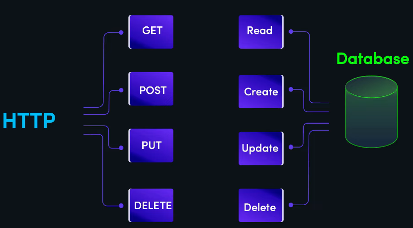
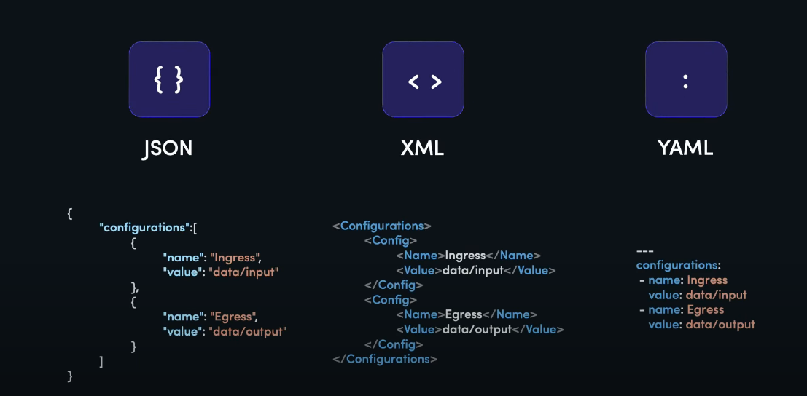
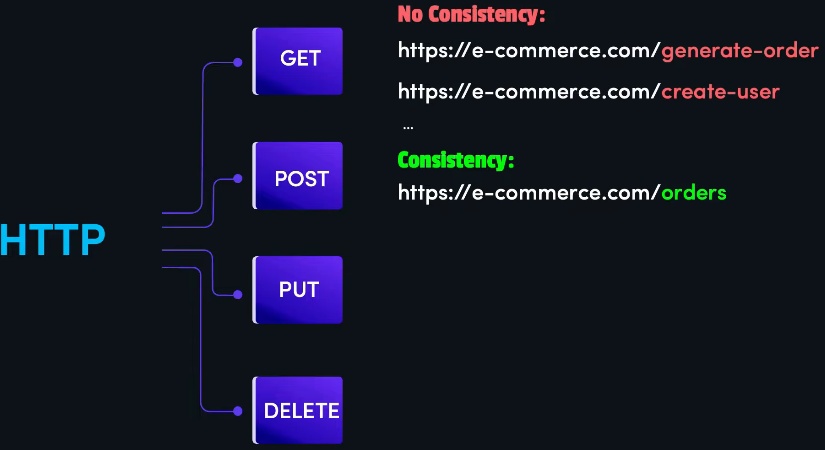

# Table of Contents

- [What is API's?](#what-is-apis)
- [What is an API architecture or protocol?](#what-is-an-api-architecture-or-protocol)
- [RESTful API](#restful-api)
- [Design for the APIs](#design-for-the-apis)
- [HTTP Methods vs database Statement](#http-methods-vs-database-statement)

## What is API's?

**Explanation:**

An application programming interface is a way for two or more computer programs or components to communicate with each other.

**Key Concepts:**

- **Endpoints**: Specific URLs provided by the API where requests can be made.
- **Requests and Responses**: The communication between the client and the server, where the client makes a request and the server sends a response.
- **HTTP Methods**: Common methods include GET (retrieve data), POST (send data), PUT (update data), and DELETE (remove data).

- **Data Formats**: Common formats for data exchange, such as JSON (JavaScript Object Notation) and XML (eXtensible Markup Language).

## What is an API architecture or protocol?

**Explanation:**

API architecture or protocol defines the rules and conventions for building and interacting with APIs. It determines how data is exchanged between the client and the server, the structure of the requests and responses, and the methods used for communication.

**Key Concepts:**

- **REST (Representational State Transfer)**: An architectural style that uses standard HTTP methods and is stateless. It relies on resources identified by URLs and uses JSON or XML for data exchange.

## RESTful API

**Explanation:**

REST is a set of architectural constraints, not a protocol or a standard. API developers can implement REST in a variety of ways.

When a client request is made via a RESTful API, it transfers a representation of the state of the resource to the requester or endpoint. This information, or representation, is delivered in one of several formats via HTTP: JSON (Javascript Object Notation). JSON is the most generally popular file format to use because, despite its name, it’s language-agnostic, as well as readable by both humans and machines.

**Key Concepts:**

- **Endpoints**: Specific URLs provided by the API where requests can be made.
- **HTTP Methods**: Common methods include GET (retrieve data), POST (send data), PUT (update data), and DELETE (remove data).
- **Status Codes**: Standard HTTP status codes to indicate the result of the request (100 Informational responses, 200 Successful responses, 300 Redirection messages, 400 Client error responses, 500 Server error responses).
- **Statelessness**: Each request from the client to the server must contain all the information needed to understand and process the request. The server does not store any state about the client session.
- **Uniform Interface**: Simplifies and decouples the architecture, which enables each part to evolve independently. The uniform interface includes:
  - Resource identification in requests (URIs)
  - Resource manipulation through representations (JSON)
  - Self-descriptive messages (HTTP headers)

## Design for the APIs

**Key Concepts:**

- **Resource-Oriented Design**: Design APIs around resources (customers, orders) rather than actions (create order).
- **HTTP Verbs**: Use HTTP methods to perform actions on resources, maintaining consistency.

