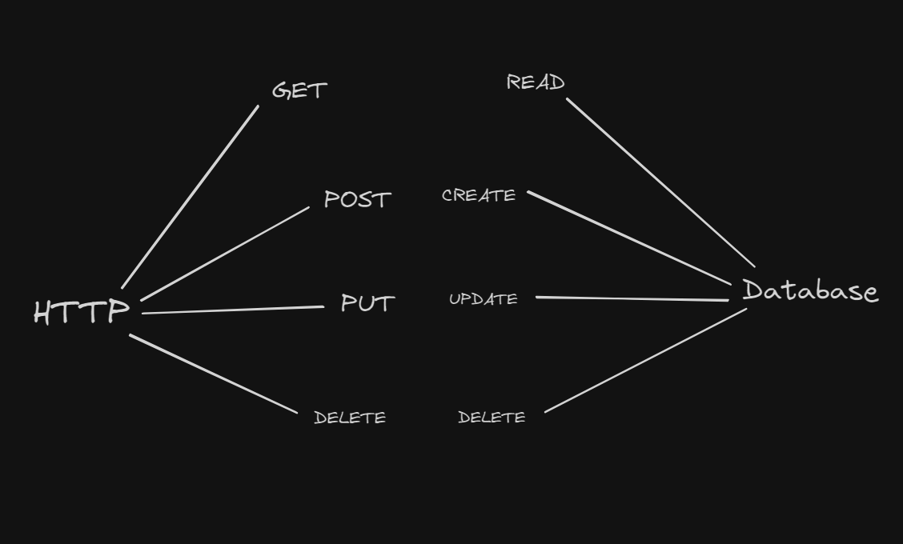
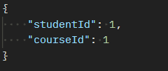
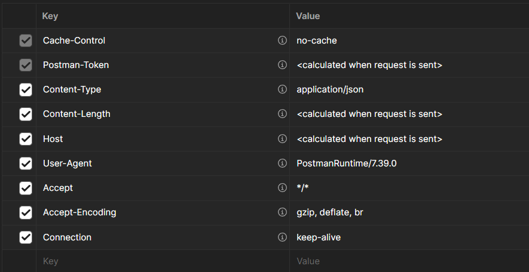

<!-- markdownlint-disable MD033 -->
# Content of Table

- [Postman](#postman)
- [Types of Requests](#types-of-requests)
- [Collections](#collections)
- [Environments](#environments)
- [Data Manipulation and Dynamic Generation](#data-manipulation-and-dynamic-generation)
- [Tests](#tests)
- [Runner](#runner)
- [Testing Methodology](#testing-methodology)
- [Documentation](#documentation)

## Postman

**Explanation:**

Tool that developers and testers use to send requests to and receive responses from an API. It's used to test, document APIs.

## Types of Requests

**Explanation:**

<details>
    <summary>Key Concepts:</summary>

1. **HTTP Requests:** Postman can send various types of HTTP requests like `GET`, `POST`, `DELETE`, `PUT`, `PATCH`, `HEAD`, `OPTIONS`. Each request can have multiple `parameters`, `headers`, `body` content.

    <details>
       <summary>Syntax:</summary>

    - *Example of URL:*

    ```text
    {protocol}://{domain/IP}:{port}/{resource}/{subresource}/{path_variable}?{query_key}={value}&{another_key}={value}
    ```

    - *Example of Request:*

    ```text
    POST /users HTTP/1.1
    Host: jsonplaceholder.typicode.com
    Content-Type: application/json

    {
    "name": "Vardenis",
    "username": "Pavardenis",
    "email": "Vardenis.Pavardenis@example.com"
    }
    ```

    - *Example of Response:*

    ```json
    {
        "id": 11,
        "name": "Vardenis",
        "username": "Pavardenis",
        "email": "Vardenis.Pavardenis@example.com"
    }
    ```

    </details>

    <details>
       <summary>Examples:</summary>

    **HTTP requests vs DB requests:**

    

    **Example of request responses creation:**

    1. Create New Request (`GET`, `POST`, `PUT`, `PATCH`, `DELETE`)
    2. Set Up the Request:
        - Type: `GET`
        - URL: `https://jsonplaceholder.typicode.com/users/1`
    3. Send the Request:
        - Click "Send".
    4. Save the Response Example:
        - Click "Save Response".
        - Nameing can be "Get User Response" or 200 OK or other status code.

    **Path Variables:**

    

    **Query Params:**

    

    **Body:**

    

    **Header:**

    

    </details>

2. **WebSocket Requests:** Establish a persistent, **full-duplex - No polling is required server and client can send information with minimum overhead(delay)** communication channel between the client and server. Useful for real-time applications like chat, live updates, and gaming.

3. **Socket.IO Requests:** A library that enables real-time, bidirectional, and event-based communication between web clients and servers. It abstracts WebSocket and provides additional features like automatic reconnection and broadcasting.

4. **GraphQL Requests:** A query language for APIs that allows clients to request exactly the data they need.

</details>

## Collections

<details>
    <summary>Key Concepts:</summary>

1. **Collections:** A collection allows you to group individual requests together. These collections can be run together as a series of requests, in a specified sequence.
    - **Folders:** Folders within a collection allow you to organize your requests.

</details>

## Environments

<details>
    <summary>Key Concepts:</summary>

1. **Environments:** Environments in Postman are key-value pairs of variables. These variables can be used in request URLs, headers, body data, and test scripts. Environments can be `Global`, `Local`, or specific to a `Collection`.

2. **Types of Environments:**
    - **Global Environment:** Variables that are accessible across all collections and requests.
    - **Local Environment:** Variables that are specific to a single request or collection.
    - **Collection-Specific Environment:** Variables that are specific to a particular collection.

</details>

## Data Manipulation and Dynamic Generation

<details>
    <summary>Key Concepts:</summary>

1. **Generating Data Dynamically:**

**Explanation:**

You can also use pre-request scripts to generate built-in dynamic variables to generate random data for your requests.

<details>
    <summary>Syntax:</summary>

```json
{
    "random": "{{$randomSomething}}",
}
```

</details>

   <details>
       <summary>Examples:</summary>

```json
{
  "id": "{{$randomInt}}",
  "name": "{{$randomFullName}}",
  "email": "{{$randomEmail}}",
  "address": "{{$randomStreetAddress}}",
  "city": "{{$randomCity}}",
  "country": "{{$randomCountry}}"
}
```

</details>

2. **set(), get(), unset() methods:**

**Explanation:**

These are specific methods provided by Postman that allow you to manipulate scope variables. They are often used within pre-request scripts and tests, and can be used in conjunction with dynamically generated data.

<details>
    <summary>Syntax:</summary>

```js
// Set a variable in the Environment, Global, Collection scopes in Pre-request Script
pm.[SCOPE].set("variable_key", variable_value);

// Get the variable from the Environment, Global, Collection scopes in Test Script (Post-response)
let value = pm.[SCOPE].get("variable_key");

// Delete variable from Environment, Global, Collection scopes in Test Script (Post-response)
pm.[SCOPE].unset("variable_key");
```

</details>

<details>
    <summary>Examples:</summary>

```js
// Set a variable in the environment scope
pm.environment.set("userId", "12345");

// Get the variable from the environment scope in Test Script (Post-response)
let userId = pm.environment.get("userId");

// Unset the variable from the environment scope
pm.environment.unset("userId");
```

</details>

</details>

## Tests

1. **Tests:**

    **Explanation:**

    Postman allows you to write test scripts and pre-request scripts for your API requests. Test scripts are executed after a response is received from the server, allowing you to validate the response data, status, performance, and more. Pre-request scripts are run before the request is sent, allowing you to set up variables, parameters, and other request data.

    **Syntax:**

    ```js
    pm.test("Description of The Test", function () {
        // function body
        // What kind of functionallity will do this function
    })
    ```

    **Pre-request Script**

    **Examples:**

    1. **Generate Random User**

        This script generate random data.

        ```js
        let username = 'User' + Math.random().toString(36).substring(2, 15);
        pm.environment.set("username", username);

        let email = username + '@example.com';
        pm.environment.set("email", email);
        
        let phoneNumber = '555' + Math.floor(Math.random() * 1000000).toString().padStart(6, '0');
        pm.environment.set("phoneNumber", phoneNumber);

        let start = new Date(1970, 0, 1);
        let end = new Date(2000, 0, 1);
        let dateOfBirth = new Date(start.getTime() + Math.random() * (end.getTime() - start.getTime()));
        pm.environment.set("dateOfBirth", dateOfBirth.toISOString().split('T')[0]); // format as YYYY-MM-DD

        let cities = ['Alytus', 'Klaipėda', 'Trakai', 'Mažeikiai', 'Prienai'];
        let city = cities[Math.floor(Math.random() * cities.length)];
        pm.environment.set("city", city);

        // Set a default password
        pm.environment.set("password", "P@ssw0rd");
        ```

    2. **Return Data from API:**

        Get from API from the forst object the title

        ```js
        pm.sendRequest('https://fakestoreapi.com/products', function (err, res) {
            if (err) {
                console.log(err);
            } else {
                let firstProductTitle = res.json()[0].title;
                pm.globals.set("firstProductTitle", firstProductTitle);
            }
        });
        ```

    3. **Setting up an Authorization Token:**

        This script retrieves an `authToken` from the environment variables, prepends 'Bearer ' to it, and then sets it as a new environment variable `bearerToken`.

        ```js
        token = 'Bearer ' + pm.environment.get('authToken');
        pm.environment.set('bearerToken', token);
        ```

    **Post-response:**

    **Examples:**

    1. **Status Code Check:**

        ```js
        pm.test("Status code is 200", function () {
            pm.response.to.have.status(200);
        });
        ```

    2. **Response Time Check:**

        ```js
        pm.test("Response time is less than 200ms", function () {
            pm.expect(pm.response.responseTime).to.be.below(200);
        });
        ```

    3. **Response Body Check:**

        ```js
        pm.test("Response contains name", function () {
            let jsonData = pm.response.json();
            pm.expect(jsonData.name).to.eql("Test");
        });
        ```

    4. **Header Check:**

        ```js
        pm.test("Content-Type header is present", function () {
            pm.response.to.have.header("Content-Type");
        });
        ```

    5. **Chainable methods**

        These are used to make your tests more readable and expressive. They don't affect the assertion itself but help to chain together different parts of an assertion.

        ```js
        // It's used for readability and chaining.
        expect(foo).to.be;

        // Before a property check.
        expect(foo).to.have;

        // It's used to negate the following assertion.
        expect(foo).to.not.be;

        // Before a type check.
        expect(foo).to.be.an;

        // Before a type check.
        expect(foo).to.be.a;

        // It's used to negate the following type check.
        expect(foo).to.not.be.a;
        ```

    6. **Assertion methods**

        These are used to assert certain conditions in your tests. If the condition is true, the test passes. If it's false, the test fails.

        ```js
        // Asserts that the target is equal to value.
        expect(foo).to.equal('bar');

        // Asserts that the target is deeply equal to value.
        expect(foo).to.eql({ bar: 'baz' });

        // Asserts that the target is neither null nor undefined.
        expect(foo).to.exist;

        // Asserts that the target is strictly (===) equal to true.
        expect(foo).to.be.true;

        // Asserts that the target is strictly (===) equal to false.
        expect(foo).to.be.false;

        // Asserts that the target is greater than value.
        expect(foo).to.be.above(10);

        // Asserts that the target is less than value.
        expect(foo).to.be.below(20);

        // Asserts that the target has a property 'bar'
        expect(foo).to.have.property('bar');

        // Asserts that the target's length is 3
        expect(foo).to.have.lengthOf(3);

        // Asserts that the target is not equal to value
        expect(foo).to.not.equal('bar');

        // Asserts that the target is not deeply equal to value
        expect(foo).to.not.eql({ bar: 'baz' });
        ```

    7. **Schema validation:**

        ```js
        let schema = {
            "type": "object",
            "properties": {
                "id": { "type": "number" },
                "name": { "type": "string" },
                "type": { "type": "string" },
                "available": { "type": "boolean" }
        },
            "required": ["id", "name", "type", "available"]
        };

        let jsonData = pm.response.json();

        function validateSchema(data, schema) {
            // data (the object you want to validate) and schema (the schema you want to validate against).
            for (let key of schema.required) {
                // That iterates over each key in the required array of the schema.
                if (!data.hasOwnProperty(key) || typeof data[key] !== schema.properties[key].type) {
                    return false;
                }
            }
            return true;
        }

        pm.test("Schema is valid for all items", function() {
            // check if all items in the jsonData array match the schema. The validateSchema function is called for each item in the array.
            let allValid = jsonData.every(item => validateSchema(item, schema));
            // All items in the jsonData array match the schema
            pm.expect(allValid).to.be.true;
        });
        ```

## Runner

1. **Runner:** The collection runner lets you run all requests in a collection in a specified sequence. This can be useful for automated testing scenarios.

    **Key Concepts:**

    1. **Collection Runner:** A feature in Postman that allows you to run all requests in a collection in a specified sequence. Useful for automated testing scenarios. However, it has a limitation when used in CI/CD pipelines across different operating systems, as it may not work as expected.

    2. **Newman:** Postman's command-line collection runner. It allows you to run and test a Postman collection directly from the command-line and integrate with various CI/CD systems.

        1. Install Newman globally on your system using npm. Open your terminal and run the following command: `npm install -g newman`.

        2. Verify the installation by checking the Newman version: `newman -v`.

        3. Once Newman is installed, you can run a collection using the run command followed by the URL or local path to your Postman collection. `newman run mycollection.json`.

        4. Or if your collection is hosted on the Postman cloud:

        ```bash
        newman run https://api.getpostman.com/collections/${POSTMAN_COLLECTION_UID}?apikey=${POSTMAN_API_KEY} -e https://api.getpostman.com/environments/${POSTMAN_ENVIRONMENT_UID}?apikey=${POSTMAN_API_KEY}
        ```

## Testing Methodology

1. **Data-driven testing:**

    - **Using Data Files:** You can use data files (like CSV or JSON) to provide multiple sets of data for your tests. This allows you to run the same request multiple times with different data. This is typically what is referred to as "data-driven" testing.

## Documentation

1. **Documentation:** Postman auto-generates and hosts browser-viewable API documentation.
