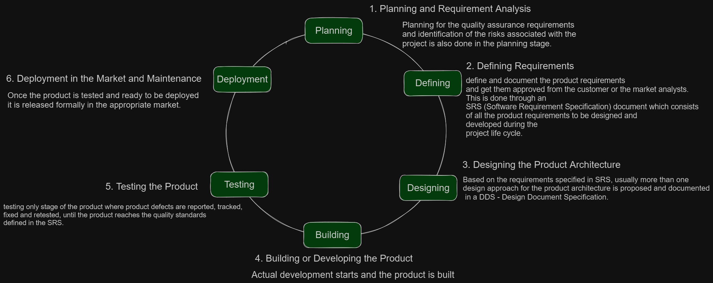
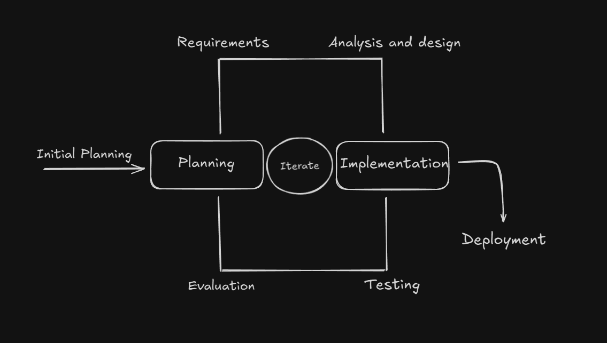
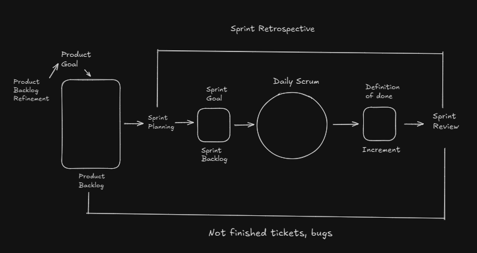
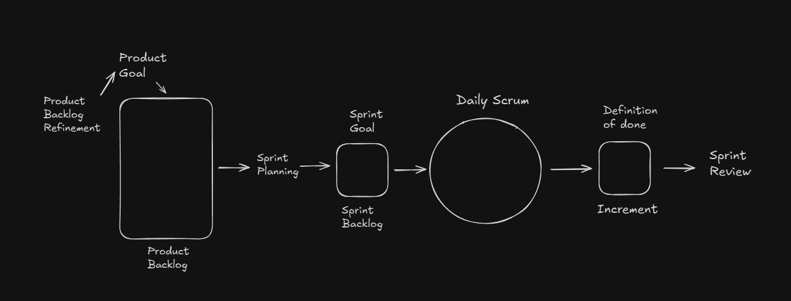
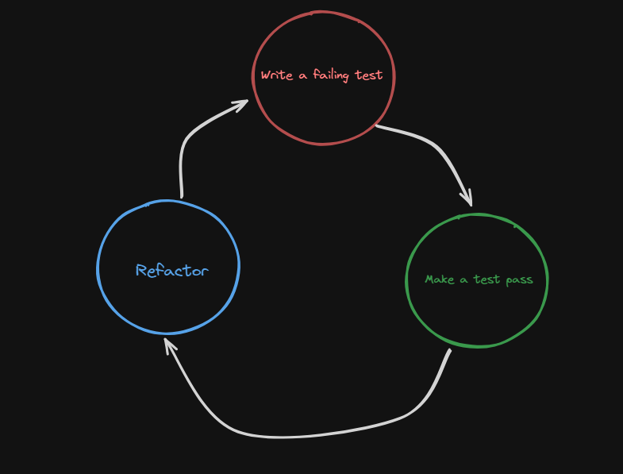
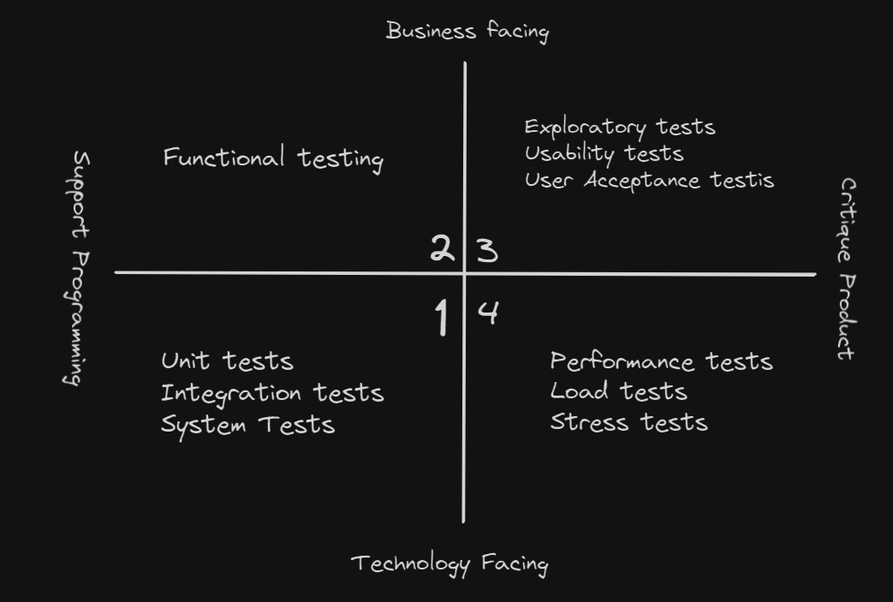
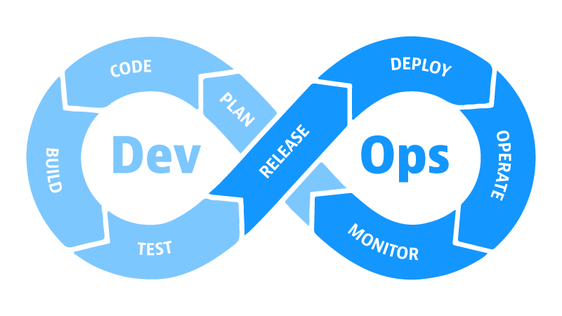

<!-- markdownlint-disable MD033 -->
# Content of Table Testing Throughout the Software Development Lifecycle

- [Software Development Life Cycle (SDLC) Models](#software-development-life-cycle-sdlc-models)
- [Testing Approaches in Software Development](#testing-approaches-in-software-development)
- [Software Testing Life Cycle (STLC)](#software-testing-life-cycle-stlc)
- [Role of Testing in DevOps](#role-of-testing-in-devops)
- [Release and Iteration Planning](#release-and-iteration-planning)
- [Maintenance Testing](#maintenance-testing)
- [Other (SDLC) Models](#other-sdlc-models)

## Software Development Life Cycle (SDLC) Models

**Explanation:**

Software Development Life Cycle (SDLC) models are methodologies that guide the process of developing software.

    
Overview:

1. **Process-oriented:** This approach focuses on the process of developing software, with an emphasis on planning, time schedules, target dates, budgets, and implementation of an entire system at one time.

2. **Iterative and Incremental SDLC Model:** This is a type of SDLC model where the software is developed incrementally and the development process is repeated in small iterations.

    - **Iterative Development:** Iterative development involves repeating the development cycle multiple times, with each iteration adding new features or refining existing ones. Each iteration builds upon the previous one, incorporating feedback and changes to improve the software.

    - **Incremental development:** Incremental development involves delivering the software in small, incremental releases. Each release includes a subset of the final features, allowing the software to be tested and used by stakeholders early in the development process.

    

    - **Agile Model:**

      **Explanation:**

      In Agile methodologies, testing is integrated throughout the development process rather than being a separate phase.

      

      

        
Overview:

      1. **Agile Manifesto:**

            - **Individuals and Interactions over Processes and Tools:** People and teamwork are more important than strict rules and tools.
            - **Working Software over Comprehensive Documentation:** Deliver software that works instead of writing lots of documents.
            - **Customer Collaboration over Contract Negotiation:** Work with customers to get things right instead of just following contracts.
            - **Responding to Change over Following a Plan:** Be ready to change plans when needed instead of sticking to a fixed plan.

      2. **Whole Team Approach:** In Agile, the whole team is responsible for quality and testing. This means that everyone, from developers to business analysts, is involved in testing activities.

      3. **Scrum Framework:** Scrum is an Agile framework used to manage product development.

          

      4. **Retrospective and Process Improvement:**

         **Explanation:**

            Retrospectives are meetings held at the end of a project, iteration, or release to reflect on the process and identify areas for improvement. The timing and organization of retrospectives depend on the specific SDLC model being followed.

         

          
Overview:

         1. **Purpose of Retrospectives:** Reflect on what was successful and should be retained and Identify what was not successful and can be improved.

         2. **Timing and Organization:** Retrospectives can be held at the end of a project, iteration, or release milestone. The timing and organization of retrospectives depend on the specific SDLC model being followed.

         3. **Participants:** Involve all relevant stakeholders, including testers, developers, architects, product owners, and business analysts.

         4. **Outcome of Retrospectives:** Document the results and include them in the test completion report.

     

    

## Testing Approaches in Software Development

**Explanation:**

Testing approaches in software development are strategies used to ensure the functionality of software works.

    
Overview:

1. **Shift Left and Right Approach:** This approach involves conducting testing early and often in the development process (shift left), and continuing testing into the deployment and maintenance stages (shift right). The "left" side could be seen as the planning and documentation stages, and the "right" side as the coding, deployment, and maintenance stages.

    - **Shift Left Approach:** The Shift Left Approach involves moving test activities to the earlier stages of the development process, such as during requirement gathering and design phases, and encouraging cooperation between QA teams, development teams, and other stakeholders like Business Analysts and Project Managers. It also includes integrating automated tests into the **Continuous Integration (CI)** pipeline for fast feedback on code changes and performing static analysis of the source code before dynamic testing to identify code quality issues early.

    - **Shift Right Approach:** **Continuous Delivery (CD)** extending testing into the deployment and maintenance stages to ensure that the software continues to function correctly in production environments. This includes implementing monitoring and observability practices to detect issues in real-time and gather feedback from production usage. Additionally, it involves collecting and analyzing user feedback to identify areas for improvement and ensure that the software meets user expectations. Post-deployment testing, such as **performance testing**, **security testing**, and user **acceptance testing (UAT)**, is also conducted to validate the software in its live environment.

    

2. **Test-Driven Development (TDD):** This is a development methodology where tests are written before the actual code.

    - **How it's work:**
        1. Write a unit test for a new function.
        2. Run the test and see it fail (since the function is not yet implemented).
        3. Write the minimum code required to pass the test.
        4. Refactor the code while ensuring the test still passes.

    

3. **Behavior-Driven Development (BDD):** Focuses on the behavior of the application, using natural language to describe test cases.

    - **How it's work:**
        1. Write scenarios in a Given-When-Then format.
        2. Translate these scenarios into automated tests.
        3. Develop the code to pass these tests.

4. **Acceptance Test-Driven Development (ATDD):** BDD focuses on the behavior of the application, using natural language to describe test cases.

    - **How it's work:**
        1. Define acceptance criteria for a user story.
        2. Write acceptance tests based on these criteria.
        3. Develop the code to pass these tests.

5. **Testing Quadrants:** This is a model that helps teams identify what type of testing is needed, when it should be done, and who should do it. It divides testing into four quadrants based on whether the tests are business or technology-facing and whether they support the team or critique the product.

    - **Quadrant 1** - Technology-Facing Tests that Support the Team: This quadrant includes tests that are technology-driven and are used to guide development. These are often automated tests. Examples include Unit Tests, Component Tests, and API Tests.

    - **Quadrant 2** - Business-Facing Tests that Support the Team: This quadrant includes tests that are business-driven and are used to describe and validate what the system should do. These tests are often automated and include tests like Functional Tests.

    - **Quadrant 3** - Business-Facing Tests that Critique the Product: This quadrant includes tests that are business-driven and are used to provide feedback. These tests are often manual and exploratory in nature. Examples include Exploratory Testing, Usability Testing, User Acceptance Testing, and Alpha/Beta Testing.

    - **Quadrant 4** - Technology-Facing Tests that Critique the Product: This quadrant includes tests that are technology-driven and are used to critique the product from a non-functional requirement perspective. These tests are often automated and include Performance Testing, Security Testing, Load Testing, and Stress Testing.

    

## Software Testing Life Cycle (STLC)

**Explanation:**

    
Overview:

1. **Requirement Analysis:** To understand the testing requirements based on the requirements document by identifying testable requirements, defining test objectives, and preparing the Requirement Traceability Matrix (RTM), resulting in a clear understanding of what needs to be tested.

2. **Test Planning:** To define the scope, approach, resources, and schedule for testing activities by developing the test plan document, identifying test objectives and criteria, estimating test effort and resources, defining test environment requirements, and identifying risks and mitigation plans, resulting in the creation of the test plan document, test effort estimation, and risk management plan.

3. **Test Design:** To design test cases and test scripts based on the requirements by creating detailed test cases, developing test data, identifying test scenarios, and reviewing and baselining test cases, resulting in the creation of test cases, test scripts, test data, and test scenarios.

4. **Test Environment Setup:** To prepare the test environment where testing will be conducted by setting up hardware and software requirements, configuring the test environment, installing necessary tools and applications, and verifying the test environment setup, resulting in the test environment being ready for execution.

5. **Test Implementation:** To develop and prioritize test cases and scripts by implementing test cases and scripts, creating test suites, and mapping test cases to requirements, resulting in test cases and scripts ready for execution and the creation of test suites.

6. **Test Execution:** To execute the test cases and report defects by executing test cases, logging defects and tracking their status, performing retesting and regression testing, and updating test cases based on feedback, resulting in test execution reports, defect logs, and updated test cases.

7. **Test Closure:** To conclude testing activities and evaluate the testing process by ensuring all test cases are executed, documenting test results and metrics, conducting a test closure meeting, archiving test artifacts, resulting in a test summary report, test metrics, archived test artifacts, and documented.

8. **Impact Analysis:** The purpose of impact analysis is to identify the areas of the application that will be impacted by a change and reduce the effort required for regression testing by focusing on the affected areas.

9. **Maintenance Testing:** Involves testing an operational system to ensure that changes or enhancements do not introduce new defects. It is conducted after the software has been released and is in use by end-users.

**There are different types of maintenance:**

- **Corrective:** Fixing known bugs or issues.
- **Adaptive:** Adapting the software to changes in the environment or improving performance.
- **Perfective:** Enhancing existing features or adding new features.

**Maintenance testing can be triggered by planned or unplanned releases:**

- **Planned Releases:** Changes that were scheduled and known in advance, such as feature enhancements or updates.

- **Unplanned Releases:** Changes that arise unexpectedly, such as hot fixes for critical issues reported by users.

**Triggers for maintenance testing include:**

- **Modifications**: Updates or enhancements to existing features.
- **Upgrades:** Introducing new features or significant changes to the software.
- **Migrations:** Moving the application from one platform to another.
- **Retirement:** Final versions of the application before it is retired, ensuring data archiving and retrieval procedures are in place.

## Role of Testing in DevOps

**Explanation:**

In DevOps, a methodology that integrates software development (Dev) and IT operations (Ops). It's not a separate phase but is integrated into every part of the development and deployment process.

    
Overview::

1. **Continuous Testing:** In DevOps, testing is conducted continuously throughout the development process.

2. **Shift Left Testing:** This approach involves conducting testing as early as possible in the development process (shifting it "left" in the timeline).

3. **Automation:** Automated testing tools are heavily used in DevOps to speed up the testing process and make it more efficient.

4. **Infrastructure as Code (IaC):** In DevOps, the infrastructure is often managed using code, which means it can be tested just like application code.

5. **Monitoring and Logging:** Continuous monitoring and logging are used in DevOps to track the application's performance and catch issues.

## Release and Iteration Planning

**Explanation:**

Release and iteration planning are essential components of the Agile methodology, ensuring that the project progresses smoothly and efficiently. These planning activities help in defining the scope of work, identifying risks, and determining the test approach for each release and iteration.

    
Overview:

1. **Release Planning:** Defining and refining the product backlog. It involves breaking down larger user stories into smaller, manageable ones. The primary goal is to identify the set of items to be worked on during the release and build a product backlog. The product owner (PO) is responsible for refining the backlog periodically. Testers contribute to release planning by participating in writing testable user stories and acceptance criteria, analyzing project and product risks, estimating test effort, and determining the test approach for the release.

2. **Sprint Planning:** Sprint planning occurs at the beginning of each Sprint, focusing on selecting items from the product backlog to be implemented during the Sprint. Testers role in Sprint planning by reviewing work products, performing detailed risk analysis of user stories, determining the testability of user stories, breaking down user stories into testing tasks, estimating test effort, and identifying functional and non-functional aspects of the test object. The key difference between release planning and Sprint planning is the scope: release planning focuses on the entire release, while Sprint planning targets specific user stories for the Sprint.

## Maintenance Testing

**Explanation:**

Maintenance testing is performed on a live application that is already in use by end users. It involves testing enhancements, bug fixes, and other changes to ensure they do not adversely affect the existing system. Maintenance testing is essentially regression testing conducted whenever changes are made to an existing application.

    
Overview:

1. **Categories of Maintenance:**

    - **Corrective:** Fixing known bugs or issues that were pending from previous releases.
    - **Adaptive:** Making changes to adapt to new environments or improve performance and maintainability.
    - **Enhancements:** Adding new features or improving existing ones based on user feedback and requirements.

2. **Impact Analysis:** Impact analysis is a study to identify the areas of the application that will be affected by the change. It helps in determining the scope of regression testing required.

3. **Triggers for Maintenance Testing:**

    - **Modifications:** Planned enhancements, updates, and hot fixes.
    - **Upgrades:** Introducing new features or moving from one version to another.
    - **Migrations:** Moving an application from one platform to another.
    - **Retirement:** Final versions of an application that will no longer receive updates or new releases.

## Other (SDLC) Models

1. **Sequential SDLC Model:** This is a type of SDLC model where development is seen as flowing steadily downwards through several phases.

    - **Waterfall Model:**

      **Explanation:**

      Waterfall Model, is a linear approach to software development.

      

    - **V-Shaped Model:**

      **Explanation:**

      Every single phase in the development cycle, there is a directly associated testing phase.

      

      **Key Concepts:**

      - **Verification:** Regularly evaluate intermediary work products during the software development lifecycle to ensure that you're on the right track. This could involve code reviews, design reviews, or reviewing other documentation.

      - **Validation:** Once the final product is ready, compare it to the user’s requirements to ensure that it meets the specified requirements. This could involve user acceptance testing or beta testing.

2. **Roles in Software Development:** These are the different roles involved in the software development process, each with specific responsibilities and tasks. They can include roles like project manager, software developer, quality assurance tester.
