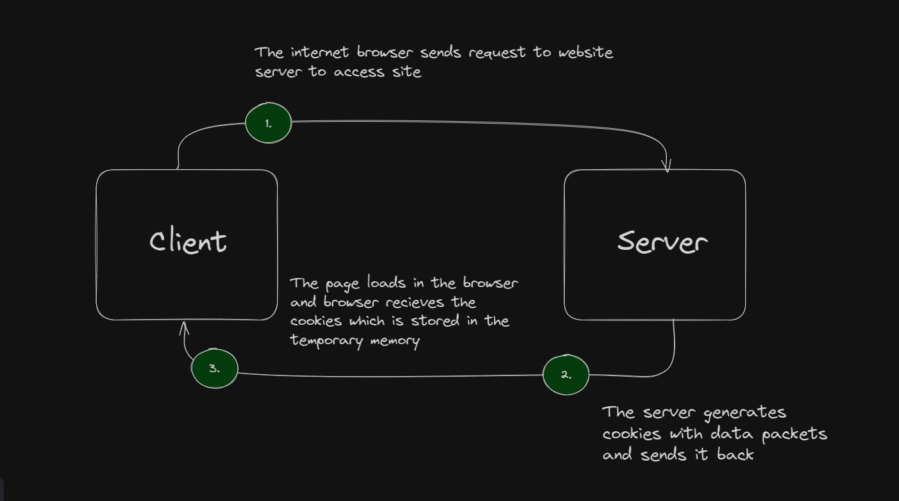

# Table of Contents

- [Server](#server)
- [APIs](#apis)
- [Session Management](#session-management)
- [Database](#database)
- [Authentication vs Authorization](#authentication-vs-authorization)
<!-- - [Web Security Knowledge](#web-security-knowledge)
    - [HTTPS](#https)
    - [CORS](#cors)
    - [Hashing Algorithms](#hashing-algorithms)
    - [OWASP Security Risks](#owasp-security-risks)
    - [Secure Sockets Layer (SSL) and Transport Layer Security (TLS)](#ssl-tls)
    - [Server Security](#server-security)
    - [Content Security Policy](#content-security-policy) --> -->

# Server

**Explanation:**

A server, in the context of computing, is a system that provides services, resources, or data to other computers, known as clients, over a network. In many cases, servers are powerful computers with large storage capacities and substantial processing power. They run specialized software to fulfill their roles.

Servers can be local (on the same network as the client) or remote (located in a data center and accessed over the internet, often referred to as a cloud server).

**Resource:**

- [Resource: Node.js](./node.js/README.md)

# APIs

**Resource:**

- [Resource: APIs](../api/README.md)

# Session Management

**Explanation:**

Session management in backend development is a mechanism by which a server maintains state information (like user identity and data) across multiple requests. When a user logs into a web application, the server initiates a session, which continues until the user logs out or the session times out. The server tracks all requests made by the same client during this session.

**Key Concepts:**

1. **Session ID:** A unique identifier that is generated when the session is started. This ID is sent to the client and returned with each request so the server can identify the session.

2. **Session Storage:** The server needs to store session data somewhere. This could be in memory, in a database, or in a file.

3. **Session Timeout:** Sessions should not last forever. The server will automatically end or invalidate a session after a certain period of inactivity.

4. **Session Hijacking:** A security threat where an attacker intercepts the session ID and uses it to impersonate the client. Countermeasures include using secure connections (HTTPS) and regularly regenerating session IDs.

5. **Cookies:** Small data files stored on the client's browser, often used to store session IDs and other user-specific information. Cookies are sent with every request to the server, enabling the server to recognize returning users and maintain their session.

6. **Token-based Authentication:** An alternative to session IDs, where the server generates a token that the client sends back with each request to prove its identity. Tokens can be designed to carry a payload of information and are particularly useful in stateless, RESTful architectures.

# Database

**Resource:**

- [Resource: Node.js](./node.js/README.md)

# Authentication vs Authorization

**Explanation:**

1. Authentication is the process of verifying the identity of a user, device, or system. It often involves a username and password, but can include any method of demonstrating identity, such as email, social media, fingerprints, voice recognition.

2. Authorization, is the process of granting or denying access to specific resources once a user's identity has been authenticated. Authorization verifies what an authenticated user is allowed to do. For example, a user might be authorized to view a resource, but not to modify it.

**Key Concepts:**

1. **Credentials:** These are the pieces of information used to authenticate a user, like a username/password, a token, or a biometric data.

2. **Basic Auth:** This is a simple authentication scheme built into the HTTP protocol. The client sends a HTTP header with the user and password fields base64 encoded. It's not secure on its own and should be used with HTTPS to protect the credentials from being intercepted.

3. **Cookie-Based Authentication:** In this method, the server creates a session for the user after the user logs in, and the session ID is stored in a cookie on the user's browser. The browser then sends the cookie with each subsequent request, allowing the server to authenticate the user.

4. **Tokens:** In some systems, after a user is authenticated, they are given a token. This token is then used for authorization in subsequent requests.

5. **Token-Based Authentication:** In this method, the server generates a token that the client will send back to prove its identity. This can be an alternative to traditional session IDs. A common type of token used in this method is JWT (JSON Web Tokens). JWTs are digitally signed, stateless, and contain a payload with the claims or assertions that are being made about the subject (usually the user).

6. **Bearer Tokens:** These are a type of access token that are delivered to the client after successful authentication. The client must send this token in the Authorization header when making requests to protected resources.

7. **Role-Based Authorization:** In many systems, users are assigned roles, and those roles are given permissions. This is a way of managing what different users are authorized to do.

8. **Access Control Lists (ACLs):** These are used in authorization and determine what resources a user or role can access.

9. **OAuth:** This is a common protocol used for authorization, allowing users to authorize websites or applications to access their information on other websites but without giving them the passwords.

