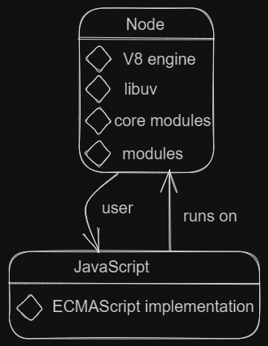

# Table of Contents

- [Node.js Introduction](#nodejs-introduction)
- [Modules](#modules)
- [Package Manager](#package-manager)
- [Working with Files](#working-with-files)
- [Creating Server](#creating-server)
- [Logging](#logging)

# Node.js Introduction

**Explanation:**

Node.js is a runtime environment that allows JavaScript to be run on the server side, outside of a browser. It's built on Chrome's V8 JavaScript engine.

While JavaScript was traditionally used for client-side scripting in the browser, Node.js extends its capabilities to server-side scripting as well.

**Key Concepts:**

- **Event-driven** means that Node.js waits for events to happen and responds to them. This is different from traditional server-side programming, where the server may wait for requests to come in and then process them.

- **Non-blocking I/O model** means that Node.js doesn't stop or "block" for Input/Output (I/O) operations like reading from the network, accessing the database or the filesystem. Instead, it continues to process other things and then comes back to the I/O operation when it's finished. This makes Node.js highly efficient and capable of handling a large number of simultaneous connections with high throughput.



# Modules

- [Common JS](#common-js)
- [ESM](#esm)

## Common JS

**Explanation:**

This is the standard used in Node.js for module management. It uses the require() function to import modules and module.exports to export them.

**Key Concepts:**

- **CommonJS:** Synchronous loading, primarily used in server-side, fully supported in Node.js.

**Syntax:**

```js
const module = require('module_name');

module.exports = module;
```

**Example:**

```js
const fs = require('fs');

module.exports = fs;
```

## ESM

**Explanation:**

This is the modern, standard JavaScript (ES6) module system. It uses import and export syntax.

**Key Concepts:**

- **ESM:** Asynchronous loading, used in both server-side and client-side, support is increasing in Node.js and it's natively supported in most modern browsers.

**Syntax:**

```js
import module from 'module_name';

export default module;
```

**Example:**

```js
import fs from 'fs';

export default fs;
```


# Package Manager

- [npm-vs-pnpm-vs-npx](#npm-vs-pnpm-vs-npx)
- [Installing Packages](#installing-packages)
- [Updating Packages](#updating-packages)
- [Using Installed Packages](#using-installed-packages)
- [Running Scripts](#running-scripts)

## npm-vs-pnpm-vs-npx

**Explanation:**

- **npm (Node Package Manager):** This is the default package manager for the JavaScript runtime environment Node.js. It consists of a command-line client, also called npm, and an online database of public and paid-for private packages, called the npm registry. `npm install`

- **pnpm:** This is a fast, disk space efficient package manager for JavaScript. It works by creating a hard link from the npm cache to the node_modules folder of your package, thus avoiding the need of duplicating packages on disk. `pnpm add`

- **npx:** This is a package runner tool that comes with npm. It makes it easy to use CLI tools and other executables hosted on the npm registry. `npx package_name`

## Installing Packages

**Explanation:**

- **Local Installation:** This is the default method of installation. The package is installed in the `node_modules` directory of your package, and is accessible via `require()` or `import/export`.

- **Global Installation:** The package is installed globally on your system and can be accessed from anywhere on your system. This is often used for packages that provide command-line utilities.

**Key Concepts:**

- **Local Installation:** Package is installed and accessible within your project. It's added to the `dependencies` in your `package.json` file. `npm install`

- **Global Installation:** Package is installed system-wide and can be used in any project. However, it's not listed in the `dependencies` in the `package.json` file. `npm install -g`

# Working with Files

**Explanation:**

- **fs module:** This is a built-in Node.js module for working with the file system. It provides functions for reading and writing files, creating directories, and more.

- **path module:** This is a built-in Node.js module for working with file and directory paths. It provides utilities for working with file and directory paths.

- **process.cwd():** This is a method in Node.js that returns the current working directory of the Node.js process.

- **__dirname:** This is a variable in Node.js that contains the directory name of the current module.

**__filename:** This is a variable in Node.js that contains the file name of the current module.

Key Concepts:

- **fs module:** Used for file system operations.

    ```js
    const fs = require('fs');

    fs.readFile('test.txt', 'utf8',(err, data) => {
        if (err) throw err;
        console.log(data);
    });
    ```

- **path module:** Used for handling and transforming file paths.

    ```js
    const path = require('path');

    console.log(path.join('/foo', 'bar', 'baz/asdf', 'quux', '..'));
    ```

- **process.cwd():** Gives the current working directory.

    ```js
    console.log(`Current directory: ${process.cwd()}`);
    ```

- **__dirname:** Gives the directory of the current executing script.

    ```js
    console.log(`Directory name: ${__dirname}`);
    ```

- **__filename:** Gives the filename of the current executing script.

    ```js
    console.log(`File name: ${__filename}`);
    ```

# Creating Server

- [Express.js](#expressjs)

## Express.js

**Resource:**

- [Resource: Express framework](./framework/express.md)

# Logging

- [Winston](#winston)

## Winston