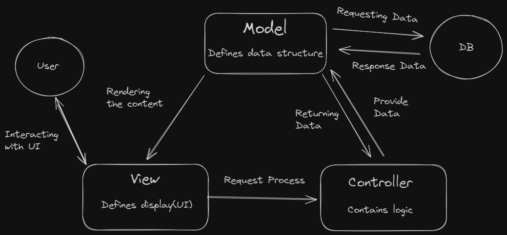

# Table of Contents

- [Model-View-Controller (MVC)](#model-view-controller-mvc)

## Model-View-Controller (MVC)

**Explanation:**

Model-View-Controller (MVC) is a software design pattern commonly used in web application development. It divides the related program logic into three interconnected elements, each with its own responsibilities, to separate internal representations of information from the ways that information is presented to and accepted from the user.

**Key Concepts:**

- **Model:** The Model represents the data and the rules that govern access to and updates of this data. In essence, it is the domain-specific representation of the information on which the application operates. The model manages the behavior and data of the application domain, responds to requests for information about its state, and responds to instructions to change state.

- **View:** The View renders the Model into a form suitable for interaction, typically a user interface element. It manages the graphical and/or textual output to the user. Multiple views can exist for a single model for different purposes.

- **Controller:** The Controller interprets the mouse and keyboard inputs from the user, informing the Model and/or the View to change as appropriate. It's the means by which the user interacts with the application. The controller processes and responds to events, typically user actions, and may invoke changes on the model.