# Table of Contents

- [QA Basics](#qa-Basics)
  - [What is Quality Assurance?](#what-is-quality-assurance)
    - [What is Quality?](#what-is-quality)
    - [What is Assurance?](#what-is-assurance)
    - [Quality Assurance in Software Testing](#quality-assurance-in-software-testing)
  - [Tester Mindset](#tester-mindset)
    - [Explanation of Tester Mindset](#explanation-of-tester-mindset)
  - [Test Oracles](#test-oracles)
    - [Explanation of Test Oracles](#explanation-of-test-oracles)
    - [Types of Test Oracles](#types-of-test-oracles)
  - [Test Prioritization](#test-prioritization)
    - [Explanation of Test Prioritization](#explanation-of-test-prioritization)
    - [Test Prioritization Techniques](#test-prioritization-techniques)
  - [Black Box vs Gray Box vs White Box Testing](#black-box-vs-gray-box-vs-white-box-testing)
    - [Differences and similarities](#differences-and-similarities)
    - [When to apply each approach](#when-to-apply-each-approach)
  - [Test Case Design](#test-case-design)
    - [Writing effective test cases](#writing-effective-test-cases)
    - [Test case structure and format](#test-case-structure-and-format)
    - [Test case prioritization](#test-case-prioritization)
  - [Testing Techniques](#testing-techniques)
    - [Non-Functional Testing](#non-functional-testing)
      - [Load Testing](#load-testing)
      - [Performance Testing](#performance-testing)
      - [Stress Testing](#stress-testing)
      - [Security Testing](#security-testing)
      - [Accessibility Testing](#accessibility-testing)
    - [Functional Testing](#functional-testing)
      - [User Acceptance Testing (UAT)](#uat)
      - [Exploratory Testing](#exploratory-testing)
      - [Smoke and Sanity Testing](#smoke-and-sanity-testing)
      - [Regression Testing](#regression-testing)
      - [Unit Testing](#unit-testing)
      - [E2E testing](#e2e-testing)
      - [Integration Testing](#integration-testing)
- [Software Development Life Cycle (SDLC) Delivery Model](#sdlc)
    - [Agile Model](#agile-model)
    - [Waterfall Model](#waterfall-model)
- [QA Manual Testing](#qa-manual-testing)
    - [Test Planning](#test-planning)
    - [TDD - Test Driven Development](#tdd)
    - [Test Cases and Scenarios](#test-cases-and-scenarios)
    - [Reporting](#reporting)
    - [Compatibility](#compatibility)
    - [Verification and Validation](#verification-and-validation)
- [Non Functional Testing](#non-functional-testing)
  - [Accessibility testing](#accessibility-testing)
  - [Load and Performance Testing](#load-and-performance-testing)
    - [Lighthouse](#lighthouse)
- [Automated Testing](#automated-testing)
  - [Frontend automation](#frontend-automation)
    - [Basic Introduction](#basic-introduction)
      - [HTML/CSS/JavaScript Basics](#html-css-javascript-basics)
      - [Browser DevTools](#browser-devtools)
      - [Caching](#caching)
      - [SSR vs CSR vs SSG](#ssr-csr-ssg)
      - [SWAs, PWAs and Jamstack](#swas-pwas-jamstack)
      - [Responsive vs adaptive](#responsive-vs-adaptive)
  - [Backend Automation](#backend-automation)
    - [Postman](#postman)
  - [Cypress](#cypress)

# QA Basics

## What is Quality Assurance?

### What is Quality?

**Explanation:**

Quality refers to the degree of excellence or superiority of a product or service. In software, quality encompasses factors such as reliability, performance, security, usability, and meeting customer expectations.

**Key Concepts:**

- **Fitness for Purpose**: A product meets its intended purpose effectively.
- **Conformance to Requirements**: The product adheres to specified requirements.
- **Customer Satisfaction**: The product satisfies customer needs and expectations.
- **Continuous Improvement**: Ongoing efforts to enhance quality.

### What is Assurance?

**Explanation:**

Assurance involves building confidence that a product will meet its quality objectives. It involves proactive activities that help prevent defects and issues.

**Key Concepts:**

- **Preventive Activities**: Measures taken to avoid defects in the first place.
- **Process Adherence**: Ensuring that processes are followed consistently.
- **Standardization**: Implementing best practices and standards.
- **Early Detection**: Identifying and addressing issues early in the development lifecycle.

### Quality Assurance in Software Testing

**Explanation:**

Quality Assurance (QA) in software testing involves processes and practices that ensure software products meet specified quality standards.

**Key Concepts:**

- **Process Improvement**: Identifying areas for process enhancement.
- **Standardization**: Establishing testing standards and guidelines.
- **Test Planning**: Developing comprehensive test plans.
- **Metrics and Measurement**: Using metrics to assess and improve quality.

**Resources:**

- [Article: What is Quality Assurance(QA)?](https://www.guru99.com/all-about-quality-assurance.html)
- [Video: What Does a QA Engineer Actually Do?](https://www.youtube.com/watch?v=jVv3A3t2DBI)

**Tasks**

- [1 Task](../tasks/testing/manualTesting/README.md)

## Tester Mindset

### Explanation of Tester Mindset

**Explanation:**
The "Tester Mindset" refers to the collection of qualities, attitudes, and approaches that make a software tester effective in their role. It involves a combination of critical thinking, attention to detail, empathy, curiosity, and a commitment to delivering high-quality software.

**Key Qualities and Attitudes:**

- **Critical Thinking**: Testers analyze requirements, design, and code critically to identify potential defects.
- **Attention to Detail**: Testers meticulously scrutinize each component to catch even minor issues.
- **Empathy**: Testers put themselves in users' shoes to understand their needs and expectations.
- **Curiosity**: Testers are naturally curious, always exploring the application to uncover defects.
- **Open-Mindedness**: Testers approach testing with an open mind, avoiding assumptions.
- **Communication Skills**: Testers effectively communicate issues to developers and stakeholders.
- **Problem-Solving**: Testers have a knack for finding solutions to complex issues.
- **Continuous Learning**: Testers stay updated with technology trends and testing methodologies.

**Resources:**

- [Video: Explanation of Tester Mindset](https://www.youtube.com/watch?v=BCuZfdbWnl8)

## Test Oracles

### Explanation of Test Oracles

**Explanation:**

A **test oracle** is a mechanism or principle used to determine the expected outcome of a test case. It's a benchmark against which the actual output of a software component or system is compared to determine if the behavior is correct or not.

**Key Concepts:**

- **Expected Behavior**: Test oracles establish what the system's behavior should be under specific conditions.
- **Validation**: Test oracles are used to validate the correctness of outputs.
- **Manual and Automated**: Oracles can be manual (human judgment) or automated (defined by rules).
- **Dynamic and Static**: Dynamic oracles evaluate runtime behavior, while static oracles analyze code or documentation.
- **Challenges**: Creating accurate and reliable test oracles can be challenging.

**Resources:**

[Video: Explanation of Test Oracles](https://www.youtube.com/watch?v=DR22zNNetp0)

### Types of Test Oracles

**Explanation:**

There are different types of test oracles used to determine expected outcomes based on different criteria.

**Types:**
- **Explicit Oracles**: Clearly defined expected results based on specifications.
- **Derived Oracles**: Derived from the same system or similar systems.
- **Comparative Oracles**: Compare the system under test to another system or model.
- **Stochastic Oracles**: Use statistical data to determine expected behavior.

## Test Prioritization

**Resources:**

- [Article: Test Prioritization](https://www.professionalqa.com/test-prioritization)

### Explanation of Test Prioritization

**Explanation:**

Test prioritization is the process of ordering or ranking test cases based on their importance, risks, and potential impact on the system under test. It ensures that the most critical tests are executed first, optimizing testing efforts in scenarios where time and resources are limited.

**Key Concepts:**

- **Risk Assessment**: Test prioritization considers factors like critical functionalities, user impact, and potential defects.
- **Resource Optimization**: It ensures that high-priority tests are executed within constrained resources.
- **Early Detection**: Prioritizing critical tests increases the chances of detecting showstopper issues early.
- **Test Dependencies**: Dependencies among test cases influence their order of execution.

### Test Prioritization Techniques

**Explanation:**

There are various techniques to prioritize test cases based on different criteria.

**Techniques:**

- **Risk-Based Prioritization**: Prioritize based on potential risks and their impact.
- **Requirements-Based Prioritization**: Prioritize based on critical functionalities or requirements.
- **Customer Impact Prioritization**: Prioritize based on user impact and customer needs.
- **Automated Test Impact Analysis**: Prioritize tests affected by code changes.
- **Dependency-Based Prioritization**: Prioritize tests with dependencies on other tests.

**Resources:**

- [Video: Test Prioritization Techniques](https://www.youtube.com/watch?v=drUfHG6tav8)

## Black Box vs Gray Box vs White Box Testing

**Resources:**

- [Video: Black Box vs Gray Box vs White Box Testing](https://www.youtube.com/watch?v=CPVMbZYeiF4)

### Differences and Similarities

**Explanation:**

Black box testing, gray box testing, and white box testing are three distinct testing approaches that involve different levels of access to the internal components of the software.

**Black Box Testing:**

- **Access to Code**: Testers have no knowledge of the internal code or logic.
- **Focus**: Testing is based on external behavior and functional requirements.
- **Testers Role**: Testers focus on inputs and expected outputs without knowledge of the internal implementation.
- **Similarities**: It is similar to how end-users interact with the system.

- [Article: Black Box Testin](https://www.guru99.com/black-box-testing.html)

**Gray Box Testing:**

- **Access to Code**: Testers have partial knowledge of the internal code and logic.
- **Focus**: Testing combines aspects of both black box and white box testing.
- **Testers Role**: Testers can design tests based on the understanding of internal logic to target specific areas.
- **Similarities**: It bridges the gap between black box and white box testing.

- [Article: Gray Box Testing](https://www.guru99.com/grey-box-testing.html)

**White Box Testing:**

- **Access to Code**: Testers have complete knowledge of the internal code and logic.
- **Focus**: Testing is based on code structure, paths, and logic flow.
- **Testers Role**: Testers can design tests to cover specific code paths and conditions.
- **Similarities**: It is akin to how developers analyze the code.

**Resources:**

- [Article: White Box Testing](https://www.guru99.com/white-box-testing.html)

### When to Apply Each Approach

**Explanation:**

The choice between black box, gray box, and white box testing depends on the goals of testing, the knowledge available, and the desired coverage.

**Black Box Testing:**

- Suitable for testing user interface, functional requirements, and overall system behavior.
- Used during acceptance testing, regression testing, and user-focused testing.

**Gray Box Testing:**

- Suitable for scenarios where partial knowledge of the internal logic can enhance testing.
- Used when a combination of black box and white box testing is needed.

**White Box Testing:**

- Suitable for in-depth testing of code logic, paths, and boundary conditions.
- Used during unit testing, code review, security testing, and code optimization.

## Test Case Design

### Writing Effective Test Cases

Writing effective test cases is crucial for thorough testing and accurate defect detection. Effective test cases should be clear, concise, and detailed. They need to cover various scenarios, conditions, and user interactions to ensure comprehensive testing.

**Key Points:**

- **Clear Steps**: Each test case should have a clear set of steps to execute.
- **Expected Results**: Clearly define the expected outcomes and results.
- **Coverage**: Ensure that each test case covers a specific functionality or scenario.
- **Variety**: Include positive and negative scenarios, boundary conditions, and edge cases.
- **Reusability**: Design test cases that can be reused in different test cycles.

### Test Case Structure and Format

A standardized test case structure and format make test cases consistent and easy to understand for the entire testing team. A well-structured test case includes sections such as the test case ID, description, preconditions, steps, expected results, actual results, and status.

**Key Points:**

- **Test Case ID**: A unique identifier for each test case.
- **Description**: Briefly describe the purpose of the test case.
- **Preconditions**: List any conditions that must be met before executing the test case.
- **Steps**: Outline the steps needed to execute the test case.
- **Expected Results**: Clearly state the expected outcomes after each step.
- **Actual Results**: Record the actual outcomes during test execution.
- **Status**: Indicate whether the test case passed, failed, or needs further investigation.

- 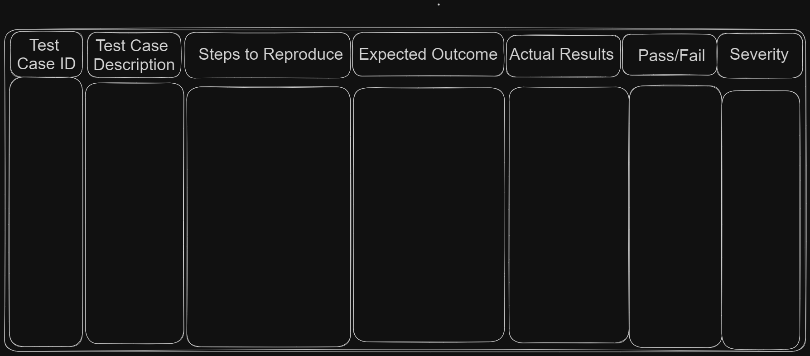

**Resources:**

- [Article: Writing Effective Test Cases and Test Case Structure and Format](https://www.guru99.com/test-case.html)
- [Article: Test Case Design](https://www.guru99.com/software-testing-techniques.html)

### Test Case Prioritization

Test case prioritization involves determining the order in which test cases should be executed based on factors such as business impact, risk, and critical functionality. Prioritization helps ensure that the most important areas are tested first, especially when time or resources are limited.

**Key Points:**

- **Business Impact**: Identify test cases that directly impact core business processes.
- **Risk Analysis**: Assess potential risks and prioritize test cases in high-risk areas.
- **Critical Functionality**: Prioritize test cases for critical features or functionalities.
- **Dependencies**: Consider dependencies between test cases and prioritize accordingly.
- **Regression Testing**: Prioritize test cases that cover areas prone to regression.

**Resources:**

- [Video: Test Case Design](https://www.youtube.com/watch?v=NKrFLbTiBQc)

**Tasks:**

- [2 Task](../tasks/testing/manualTesting/README.md)

## Testing Techniques

**Resources:**

- [Article: Testing Techniques](https://www.guru99.com/non-functional-testing.html)

### Non-Functional Testing

#### Load Testing

**Explanation:**

Load testing involves assessing a system's performance under specific load conditions to determine its capacity and capability to handle a certain volume of users or transactions.

**Key Concepts:**

- **Load**: The amount of work a system is subjected to during testing.
- **Objective**: Identify performance bottlenecks, measure response times, and assess system scalability.
- **Types**: Concurrent users, transactions, or data volume are typically tested.
- **Tools**: Load testing tools like JMeter, Gatling, or locust can automate load simulations.

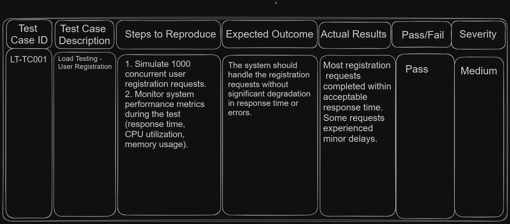

**Resources:**

- [Article: Load Testing](https://loadninja.com/load-testing/)

**Tasks**

- [3 Task](../tasks/testing/manualTesting/README.md)

#### Performance Testing

**Explanation:**

Performance testing evaluates a system's responsiveness, stability, and overall performance under varying conditions, ensuring it meets user expectations.

**Key Concepts:**

- **Types**: Includes load testing, stress testing, and endurance testing.
- **Metrics**: Key performance indicators (KPIs) such as response time, throughput, and resource utilization.
- **Benefits**: Identifies performance bottlenecks, enables capacity planning, and ensures user satisfaction.

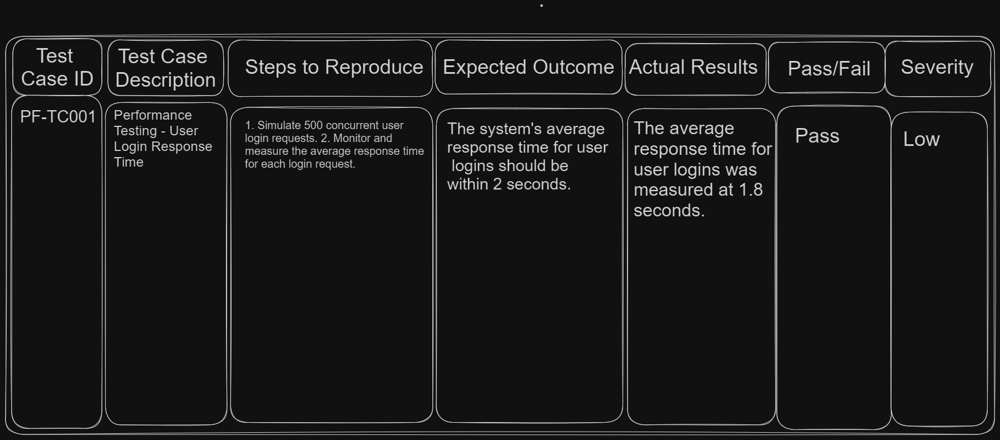

**Resources:**

- [Article: Performance Testing](https://www.guru99.com/performance-testing.html)

**Tasks**

- [4 Task](../tasks/testing/manualTesting/README.md)

#### Stress Testing

**Explanation:**

Stress testing evaluates a system's behavior under extreme conditions that exceed its normal operational capacity. It helps identify breaking points and potential failures.

**Key Concepts:**

- **Types**: Overloading system resources, such as memory, CPU, or network.
- **Purpose**: Determine system stability and reliability under high stress.
- **Challenges**: Requires careful planning to avoid damaging the system during testing.

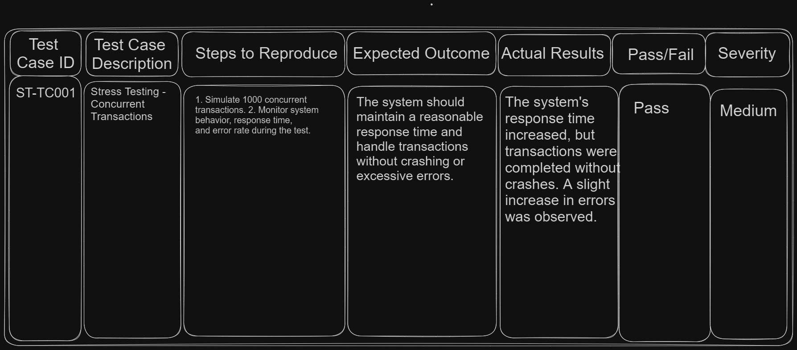

**Resources:**

- [Article: Stress Testing](https://www.guru99.com/stress-testing-tutorial.html)
- [Article: What is a DoS Attack and How to DoS Someone [Ping of Death]](https://www.guru99.com/ultimate-guide-to-dos-attacks.html)

**Tasks**

- [5 Task](../tasks/testing/manualTesting/README.md)

#### Security Testing

**Explanation:**

Security testing assesses a system's vulnerabilities and weaknesses to identify potential security risks and protect against unauthorized access, data breaches, and other threats.

**Key Concepts:**

- **Types**: Includes penetration testing, vulnerability scanning, and security code reviews.
- **Objectives**: Identify vulnerabilities, assess risk levels, and ensure compliance with security standards.
- **Criticality**: Security testing is crucial to protect sensitive data and user privacy.

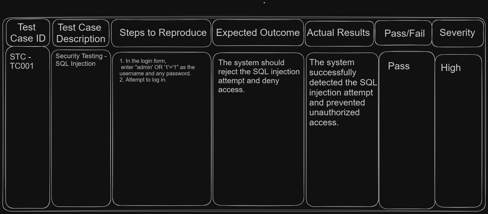

**Resources:**

- [Article: Security Testing](https://www.guru99.com/what-is-security-testing.html)
- [Article: SQL Injection Tutorial](https://www.guru99.com/learn-sql-injection-with-practical-example.html)

**Tasks**

- [6 Task](../tasks/testing/manualTesting/README.md)

#### Accessibility Testing

**Explanation:**

Accessibility testing ensures that a software application is usable by people with disabilities, conforming to accessibility standards and guidelines.

**Key Concepts:**

- **Types**: Involves testing for visual, auditory, cognitive, and motor impairments.
- **Guidelines**: Compliance with standards like WCAG (Web Content Accessibility Guidelines).
- **Importance**: Accessibility testing promotes inclusivity and ensures software is usable by all users.

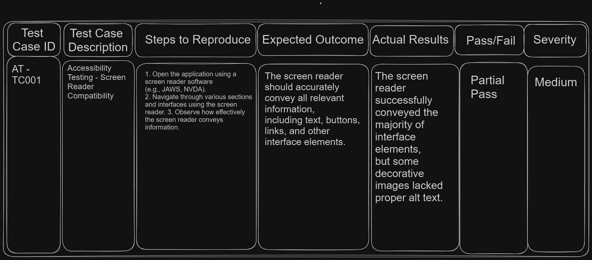

**Resources:**

- [Article: Accessibility Testing](https://www.guru99.com/accessibility-testing.html)

**Tasks**

- [7 Task](../tasks/testing/manualTesting/README.md)

### Functional Testing

#### User Acceptance Testing (UAT)

**Explanation:**

User Acceptance Testing (UAT) involves testing a software application from the user's perspective to ensure it meets business requirements and is ready for release.

**Key Concepts:**

- **Users**: Performed by end-users or stakeholders.
- **Test Cases**: Based on real-world scenarios and workflows.
- **Validation**: Verifies if the application meets business objectives.
- **Sign-off**: Successful UAT signifies readiness for production.

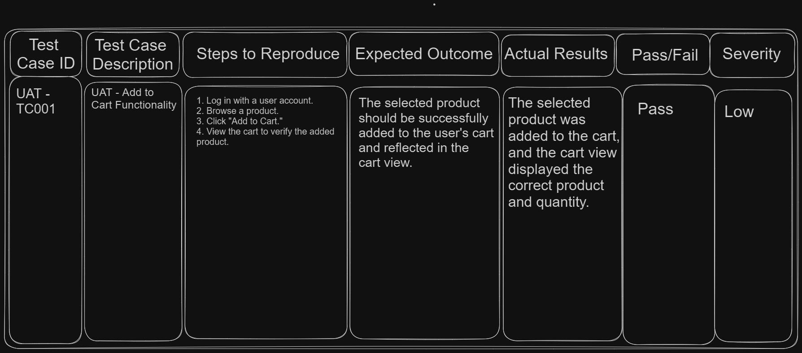

**Resources:**

- [Article: User Acceptance Testing](https://www.guru99.com/user-acceptance-testing.html)
- [Video: User Acceptance Testing (UAT)](https://www.youtube.com/watch?v=F5xaiKyJDNQ)

**Tasks**

- [8 Task](../tasks/testing/manualTesting/README.md)

#### Exploratory Testing

**Explanation:**

Exploratory Testing involves simultaneous test design and execution, where testers explore the software dynamically without predefined test cases.

**Key Concepts:**

- **Approach**: Relies on tester's creativity, intuition, and domain knowledge.
- **Flexibility**: Adaptation to evolving requirements.
- **Bug Hunting**: Efficient for finding defects in an unscripted manner.
- **Documentation**: Testers document actions, observations, and defects found.

**Resources:**

- [Article: Exploratory Testing](https://www.guru99.com/exploratory-testing.html)
- [Video: Exploratory Testing](https://www.youtube.com/watch?v=aX42Qr0eeuI&t=658s)

**Tasks**

- [9 Task](../tasks/testing/manualTesting/README.md)

#### Smoke and Sanity Testing

**Explanation:**

Smoke Testing and Sanity Testing are quick checks performed to determine whether a build is stable and if further testing can proceed.

**Smoke Testing:**

- **Objective**: Checks basic functionalities to validate if the build is stable.
- **Timing**: Performed after each new build.
- **Coverage**: Focuses on essential functionalities.

**Sanity Testing:**

- **Objective**: Ensures recent changes didn't adversely affect the system.
- **Timing**: After specific changes, fixes, or patches.
- **Coverage**: Focuses on recent modifications.

*Sanity Testing:*

*Smoke Testing:*
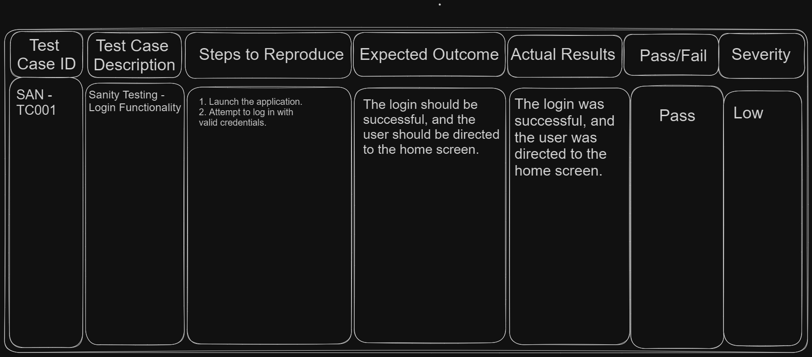

**Resources:**

- [Article: Sanity Testing Vs. Smoke Testing – Difference Between Them](https://www.guru99.com/smoke-sanity-testing.html)
- [Video: Sanity Testing Vs. Smoke Testing](https://www.youtube.com/watch?v=u5gC4bD9cCQ)

**Tasks**

- [10 Task](../tasks/testing/manualTesting/README.md)

#### Regression Testing

**Explanation:**

Regression Testing verifies that new code changes do not negatively impact existing functionalities.

**Key Concepts:**

- **Purpose**: Prevent introduction of new defects while modifying code.
- **Scope**: Re-tests affected areas and related functionalities.
- **Automated Regression**: Automated tests for efficient testing.

- 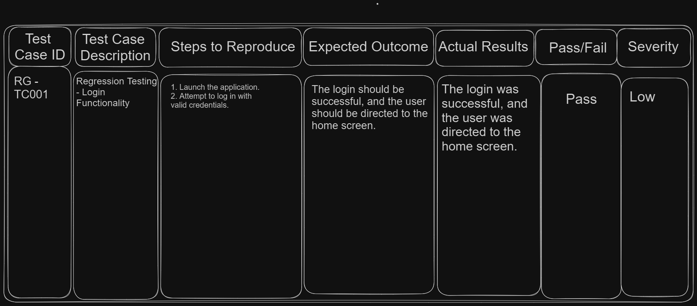

**Resources:**

- [Article: Regression Testing](https://www.guru99.com/regression-testing.html)
- [Video: Regression Testing](https://www.youtube.com/watch?v=AWX6WvYktwk&t=71s)

**Tasks**

[11 Task](../tasks/testing/manualTesting/README.md)

#### Unit Testing

**Explanation:**
Unit Testing involves testing individual units or components of a software application in isolation to ensure their correctness.

**Key Concepts:**
- **Focus**: Tests small code units like functions, methods, or classes.
- **Isolation**: Isolates units from the rest of the application.
- **Automation**: Often automated for efficient execution.
- **White Box Testing**: Requires knowledge of code internals.

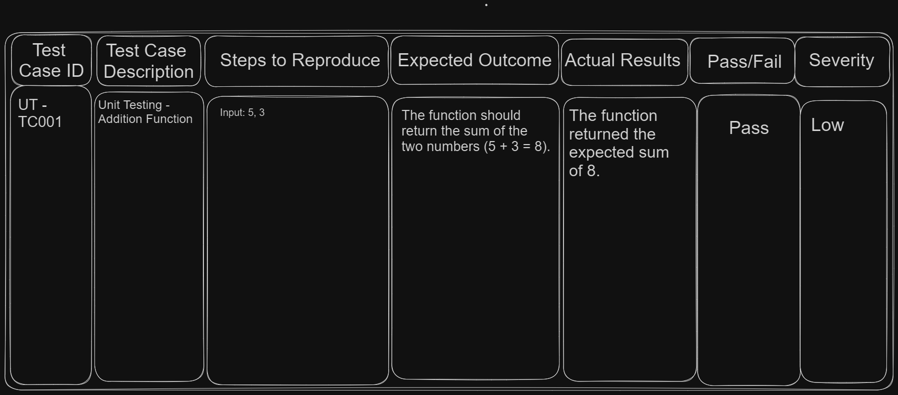

**Resources:**

- [Unit Testing](https://www.guru99.com/unit-testing-guide.html)

#### End-to-End (E2E) Testing

**Explanation:**
End-to-End (E2E) Testing validates the complete flow of an application, simulating real user scenarios.

**Key Concepts:**
- **Scope**: Verifies interactions between different system components.
- **User Journeys**: Tests complete user workflows.
- **Real-World Scenarios**: Simulates how users interact with the application.
- **Challenges**: Requires testing across various layers and technologies.

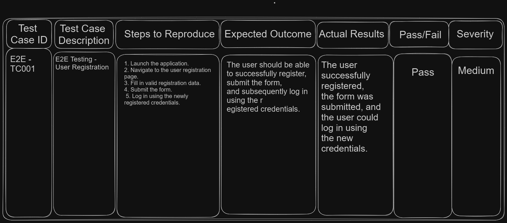

**Resources:**

- [End-to-End (E2E) Testing](https://www.guru99.com/end-to-end-testing.html)

#### Integration Testing

**Explanation:**

Integration Testing ensures that different components or modules of a software application work together seamlessly.

**Key Concepts:**

- **Interaction**: Validates interactions between integrated components.
- **Functionalities**: Tests combined functionalities of integrated parts.
- **Top-Down and Bottom-Up**: Different integration strategies.
- **Dependencies**: Identifies defects at the component interface level.

**Resources:**

- [Integration Testing](https://www.guru99.com/integration-testing.html)
 
# Software Development Life Cycle (SDLC) Delivery Model

## Agile Model

**Explanation:**

The Agile model is an iterative and incremental approach to software development. It emphasizes collaboration, flexibility, and customer feedback throughout the development process.

**Key Concepts:**

- Iterative Development: Projects are divided into short iterations (sprints) with working increments delivered in each iteration.
- Customer Collaboration: Continuous involvement and feedback from customers and stakeholders.
- Adaptability: The ability to accommodate changes in requirements even late in the development process.
- Agile Manifesto: Values individuals and interactions, working software, customer collaboration, and responding to change.

**Resources:**

- [Article: Agile model](https://www.tutorialspoint.com/sdlc/sdlc_agile_model.htm)
- [Article: Scrum](https://www.guru99.com/scrum-testing-beginner-guide.html)

## Waterfall Model

**Explanation:**
The Waterfall model is a sequential software development approach where each phase follows the previous one. It's characterized by a structured and well-defined process.

**Key Concepts:**
- Phases: Development progresses through distinct phases: requirements, design, implementation, testing, deployment, and maintenance.
- Sequential Process: Each phase must be completed before moving to the next.
- Documentation: Emphasis on comprehensive documentation at each stage.
- Rigidity: Changes to requirements are discouraged after the initial phases.

**Resources:**

- [Article: Waterfall Model](https://www.tutorialspoint.com/sdlc/sdlc_waterfall_model.htm)

# QA Manual Testing

## Test Planning

**Explanation:**

Test planning involves defining the overall testing strategy for a project, outlining objectives, scope, resources, schedules, and risks.

**Key Concepts:**

- **Objectives**: Define testing goals and expectations.
- **Scope**: Specify what will be tested and what won't.
- **Test Strategy**: Decide on test levels, types, techniques, and environments.
- **Test Schedule**: Allocate timeframes for testing activities.
- **Risk Assessment**: Identify potential risks and mitigation strategies.

**Resources:**

- [Article: Test Planning](https://www.guru99.com/what-everybody-ought-to-know-about-test-planing.html)

## Test-Driven Development (TDD)

**Explanation:**

Test-Driven Development (TDD) is a software development practice where tests are written before the actual code, promoting improved code quality and test coverage.

**Key Concepts:**

- **Red-Green-Refactor Cycle**: Write failing test (red), make it pass (green), and refactor.
- **Unit Testing**: Write unit tests for small code units.
- **Continuous Integration**: Frequent integration and automated testing.
- **Benefits**: Reduces defects, enhances design, and supports refactoring.

**Resources:**

- [Article: Test-Driven Development (TDD)](https://www.guru99.com/test-driven-development.html)

## Test Cases and Scenarios

**Explanation:**

Test cases and scenarios define the steps, conditions, and expected outcomes for testing different aspects of a software application.

**Key Concepts:**

- **Test Case**: A set of inputs, actions, and expected results.
- **Test Scenario**: A sequence of related test cases.
- **Coverage**: Ensure comprehensive coverage of functionalities.
- **Traceability**: Link test cases to requirements for validation.

**Resources:**

- [Article Test Cases and Scenarios](https://www.guru99.com/test-case-vs-test-scenario.html)
- [Video: Crash Course Test Cases and Scenarios](https://www.youtube.com/watch?v=St9Ep9gnvRw)

### Reporting

**Explanation:**

Reporting involves documenting and communicating testing activities, results, and defects to stakeholders.

**Key Concepts:**

- **Test Execution Reports**: Summarize test runs and outcomes.
- **Defect Reports**: Document defects found during testing.
- **Status Updates**: Keep stakeholders informed about progress.
- **Metrics and KPIs**: Measure testing effectiveness.

**Resources:**

- [Article: Reporting](https://www.guru99.com/defect-management-process.html)

## Compatibility Testing

**Explanation:**

Compatibility testing ensures that software works across various environments, browsers, devices, and operating systems.

**Key Concepts:**

- **Browser Compatibility**: Test across different web browsers.
- **Device Compatibility**: Test on various devices (desktop, mobile, tablet).
- **Operating System Compatibility**: Test on different OS versions.
- **Challenges**: Address differences in rendering, functionality, and performance.

**Resources:**

- [Article: Compatibility Testing](https://www.guru99.com/compatibility-testing.html)

## Verification and Validation

**Explanation:**

Verification ensures that a software product meets specified requirements, while validation ensures it meets user expectations.

**Key Concepts:**

- **Verification**: Confirm software meets design specifications.
- **Validation**: Ensure software meets user needs and intended use.
- **Quality Assurance and Testing**: Part of V&V process.
- **Validation Testing**: Focus on user acceptance and satisfaction.

**Resources:**

- [Article: Verification and Validation](https://www.guru99.com/verification-v-s-validation-in-a-software-testing.html)

# Non Functional Testing

## Accessibility Testing

**Explanation:**

Accessibility testing ensures that a software application is usable by individuals with disabilities, making it inclusive for all users. It involves evaluating the application's design, content, and functionality to ensure compliance with accessibility standards and guidelines.

**Key Concepts:**

- **WCAG Guidelines**: Web Content Accessibility Guidelines provide criteria for accessible design.
- **Types of Disabilities**: Visual, auditory, cognitive, and motor impairments.
- **Tools**: Automated accessibility testing tools and manual assessments.
- **Benefits**: Ensures equal access, avoids legal issues, and improves user satisfaction.

**Resources:**

- [Article: Accessibility Testing](https://www.geeksforgeeks.org/software-testing-accessibility-testing/)

## Load and Performance Testing

**Explanation:**
Load and Performance Testing assess the responsiveness, stability, and scalability of a software application under different levels of load and stress. It helps identify bottlenecks, analyze response times, and ensure optimal performance.

**Key Concepts:**

- **Load Testing**: Evaluates application behavior under expected load.
- **Stress Testing**: Tests application behavior under extreme load conditions.
- **Performance Testing**: Ensures application meets response time requirements.
- **Metrics**: Response time, throughput, resource utilization, and error rates.
- **Purpose**: Identify performance issues before application launch.

**Resources:**

### Lighthouse

**Explanation:**

Lighthouse is an open-source tool from Google that assesses the quality and performance of web pages. It generates reports and scores based on various performance and accessibility metrics.

**Key Features:**

- **Performance Metrics**: Measures loading times, resource usage, and more.
- **Accessibility Checks**: Identifies issues that impact users with disabilities.
- **Progressive Web App Audit**: Evaluates adherence to PWA principles.
- **Best Practices Audit**: Assesses adherence to web development best practices.

**Resources:**

- [Site: Lighthouse](https://github.com/GoogleChrome/lighthouse/)

# Automated Testing

Automated testing is a crucial practice in software development that involves using tools and scripts to automatically test software applications. This ensures that the software functions correctly, performs well, and meets its intended requirements. Automated testing helps identify bugs, regressions, and performance issues early in the development process.

## Frontend automation

Frontend automation focuses on automating tasks related to the user interface (UI) and the frontend of web applications. It streamlines development processes, enhances code quality, and improves the overall user experience.

### Basic Introduction

#### HTML/CSS/JavaScript Basics

**Resources:**

*html*
- [HTML](../frontend/html/README.md)

*css*
- [CSS](../frontend/css/README.md)

*JavaScript*
- [JavaScript](../languages/javaScript/README.md)

#### Browser DevTools

**Explanation:**

Browser DevTools are integrated developer tools available in web browsers. They provide a set of features that aid in web development and debugging.

**Key Concepts:**

- **Inspecting and Debugging:** DevTools allow developers to inspect HTML, CSS, and JavaScript, making it easier to identify and fix issues in the frontend code.
- **Network Monitoring:** You can monitor network requests and responses to optimize performance and troubleshoot issues.
- **Performance Profiling:** DevTools offer performance profiling tools to identify bottlenecks and improve website speed.

**Resources:**

- [Article: What are browser developer tools?](https://developer.mozilla.org/en-US/docs/Learn/Common_questions/Tools_and_setup/What_are_browser_developer_tools)

#### Caching

**Explanation:**

Caching ensures that the resources downloaded once are reused instead of doing a fresh fetch again. It is useful for increasing subsequent page load speed by reusing cached images, fonts, and other static assets. Caching should not be typically done on dynamic content. For example list of posts or comments. As part of the testing strategy, both caching and cache invalidation (not getting stale dynamic content) needs to be tested.

**Key Concepts:**

- **Browser Cache:** Browsers can cache static assets like images and stylesheets, improving page load times.
- **Content Delivery Networks (CDNs):** CDNs use caching to distribute content globally, reducing server load and improving content delivery.
- **Cache Control Headers:** Developers can control caching behavior using HTTP headers to set expiration times for cached resources.

**Resources:**

- [Video: Caching - Simply Explained](https://www.youtube.com/watch?v=6FyXURRVmR0)

#### SSR vs CSR vs SSG

**Explanation:**

These are different approaches to rendering web content that impact how web applications are built and perform.

**Key Concepts:**

- **Server-Side Rendering (SSR):** In SSR, web pages are rendered on the server and sent to the client as fully formed HTML. This can improve initial page load times and SEO.
- **Client-Side Rendering (CSR):** CSR relies on rendering content in the user's browser using JavaScript, enabling dynamic updates without full page reloads.
- **Static Site Generation (SSG):** SSG pre-generates web pages at build time, offering the benefits of both SSR and CSR for performance and security.

**Resources:**

- [Comparison of CSR, SSR, SSG](https://dev.to/pahanperera/visual-explanation-and-comparison-of-csr-ssr-ssg-and-isr-34ea)

#### SPAs(SWAs), PWAs and Jamstack

**Explanation:**

These are modern architectural patterns and approaches in web development.

**Key Concepts:**

**Single-Page Applications (SPAs):** SPAs load a single HTML page and dynamically update content, providing a smooth user experience.
**Progressive Web Apps (PWAs):** PWAs offer app-like experiences on the web, including offline access and push notifications.
**Jamstack:** Jamstack is an architectural pattern that decouples the frontend and backend, using APIs and pre-rendering for performance and security.

**Resources:**

- [SPAs(SWAs)](https://www.staticapps.org/)
- [PWAs and Jamstack](https://bejamas.io/blog/jamstack-pwa/)

#### Responsive vs adaptive

**Explanation:**

These design approaches ensure optimal user experiences on various devices.

**Key Concepts:**

**Responsive Design:** Responsive web design adapts to different screen sizes and orientations using flexible layouts and media queries, providing a consistent user experience.
**Adaptive Design:** Adaptive design involves creating multiple versions of a website tailored to specific device categories, ensuring specialized user experiences.

**Resources:**